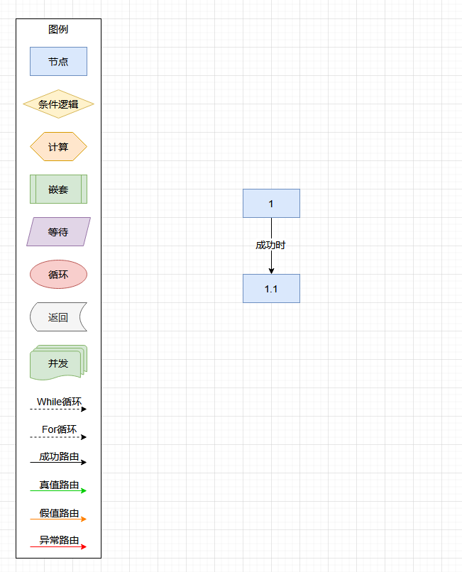
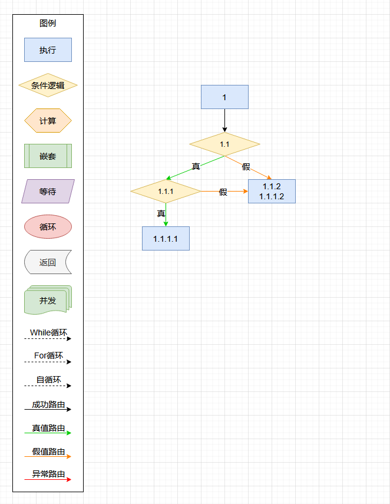
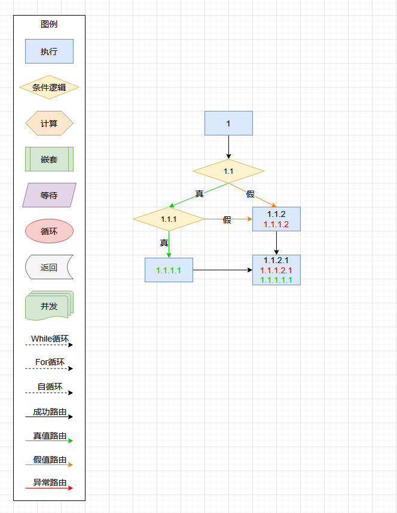

# 编排引擎 CallFlow


目录
------
* [主导思想](#主导思想)
* [概要说明](#概要说明)
* 使用举例
    * [执行元素：简单编排](#执行元素举例)
    * [执行元素的多路分支逐一执行举例](#执行元素的多路分支逐一执行举例)
    * [条件逻辑元素举例](#条件逻辑元素举例)
    * [条件逻辑元素的多条件及返回对象举例](#条件逻辑元素的多条件及返回对象举例)
    * [条件逻辑元素的非空及多路径举例](#条件逻辑元素的非空及多路径举例)
    * [多路径裂变举例](#多路径裂变举例)
    * [嵌套元素举例](#嵌套元素举例)


主导思想
------

    1. 将基础的 Java 方法灵活组合，构建特定业务逻辑。

    2. 柔性配置：组合过程无需开发，可配置、即改即用，服务无须重启。
    
    3. 可移植性：编排配置支持导出导入，便于保存、复制和升级。
    
    4. 自动化执行：只需输入数据，引擎自动执行流程并返回结果，实现“输入->执行->输出”的闭环。
    
    5. 嵌入式：编排引擎将直接嵌入业务服务中运行。
    


概要说明
------

    1. 6种编排元素。
    
        1.1. 执行元素，配置及执行Java方法。可轻松扩展它，衍生成特定的业务元素。
    
        1.2. 条件逻辑元素，与或逻辑判定。
    
        1.3. 计算元素，计算数据、加工数据、创建新数据。
        
        1.4. 等待元素，等待一段时间。
    
        1.5. 循环元素，按数组、集合或数列，循环执行一个或多个其它元素。
    
        1.6. 嵌套元素，嵌套其它编排，复用与共享编排，构建更复杂的业务。
        
    2. 4种编排路由。
        
        2.1 成功路由，元素执行成功时走的路。
        
        2.2 异常路由，元素执行出时异常时走的路。
        
        2.3 真值路由，条件逻辑元素与计算元素（逻辑类型的），结果为真时走的路。
        
        2.4 假值路由，条件逻辑元素与计算元素（逻辑类型的），结果为假时走的路。
        
    3. 2种编排循环。
        
        3.1 While循环路由，下层元素回流到上层元素时走的路。
        
        3.2 For循环路由，与循环元素配合（至少有一个），回流到循环元素的路。
        
        3.3 路由与循环可以组合后共存，即：成功路由+For循环路由组成一条成功时For循环的路由。


执行元素举例
------

[查看代码](src/test/java/org/hy/common/callflow/junit/cflow001)

__编排图例演示__



__编排配置__

```xml
<?xml version="1.0" encoding="UTF-8"?>

<config>

    <import name="xconfig"    class="java.util.ArrayList" />
    <import name="xnesting"   class="org.hy.common.callflow.nesting.NestingConfig" />
    <import name="xfor"       class="org.hy.common.callflow.forloop.ForConfig" />
    <import name="xnode"      class="org.hy.common.callflow.node.NodeConfig" />
    <import name="xwait"      class="org.hy.common.callflow.node.WaitConfig" />
    <import name="xcalculate" class="org.hy.common.callflow.node.CalculateConfig" />
    <import name="xcondition" class="org.hy.common.callflow.ifelse.ConditionConfig" />
    
    
    
    <!-- CFlow编排引擎配置 -->
    <xconfig>
        
        <xnode id="XNode_CF001_1_1">
            <comment>节点002，后面节点配置在XML前</comment>
            <callXID>:XProgram</callXID>
            <callMehod>method002</callMehod>
        </xnode>
        
        
        <xnode id="XNode_CF001_1">
            <comment>节点001</comment>
            <callXID>:XProgram</callXID>                    <!-- 定义执行对象 -->
            <callMehod>method001</callMehod>                <!-- 定义执行方法 -->
            <route>
                <succeed>                                   <!-- 成功时，关联后置节点 -->
                    <next ref="XNode_CF001_1_1" />
                    <comment>成功时</comment>
                </succeed>
            </route>
        </xnode>
        
    </xconfig>
    
</config>
```

__执行编排__

```java
// 初始化被编排的执行对象方法（按业务需要）
XJava.putObject("XProgram" ,new Program());
        
// 获取编排中的首个元素
NodeConfig          v_FirstNode = (NodeConfig) XJava.getObject("XNode_CF001_1");

// 初始化上下文（可从中方便的获取中间运算信息，也可传NULL）
Map<String ,Object> v_Context   = new HashMap<String ,Object>();

// 执行编排。返回执行结果       
ExecuteResult       v_Result    = CallFlow.execute(v_FirstNode ,v_Context);
```


执行元素的多路分支逐一执行举例
------

[查看代码](src/test/java/org/hy/common/callflow/junit/cflow005)

__编排图例演示__


__编排配置__

```xml
<?xml version="1.0" encoding="UTF-8"?>

<config>

    <import name="xconfig"    class="java.util.ArrayList" />
    <import name="xnesting"   class="org.hy.common.callflow.nesting.NestingConfig" />
    <import name="xfor"       class="org.hy.common.callflow.forloop.ForConfig" />
    <import name="xnode"      class="org.hy.common.callflow.node.NodeConfig" />
    <import name="xwait"      class="org.hy.common.callflow.node.WaitConfig" />
    <import name="xcalculate" class="org.hy.common.callflow.node.CalculateConfig" />
    <import name="xcondition" class="org.hy.common.callflow.ifelse.ConditionConfig" />
    
    
    
    <!-- CFlow编排引擎配置 -->
    <xconfig>
    
        <xnode id="XNode_CF005_1_2">
            <comment>1.2节点</comment>
            <callXID>:XProgram</callXID>
            <callMehod>method_1_2</callMehod>
        </xnode>
        
        
        <xnode id="XNode_CF005_1_1_2">
            <comment>1.1.2节点</comment>
            <callXID>:XProgram</callXID>
            <callMehod>method_1_1_2</callMehod>
        </xnode>
        
        
        <xnode id="XNode_CF005_1_1_1">
            <comment>1.1.1节点</comment>
            <callXID>:XProgram</callXID>
            <callMehod>method_1_1_1</callMehod>
        </xnode>
    
    
        <xnode id="XNode_CF005_1_1">
            <comment>1.1节点</comment>
            <callXID>:XProgram</callXID>
            <callMehod>method_1_1</callMehod>
            <route>
                <succeed>                                   <!-- 成功时，关联后置节点 -->
                    <next ref="XNode_CF005_1_1_1" />
                    <comment>成功时，第一路</comment>
                </succeed>
                <succeed>                                   <!-- 成功时，关联后置节点 -->
                    <next ref="XNode_CF005_1_1_2" />
                    <comment>成功时，第二路</comment>
                </succeed>
            </route>
        </xnode>
        
        
        <xnode id="XNode_CF005_1">
            <comment>1节点</comment>
            <callXID>:XProgram</callXID>
            <callMehod>method_1</callMehod>
            <route>
                <succeed>                                   <!-- 成功时，关联后置节点 -->
                    <next ref="XNode_CF005_1_1" />
                    <comment>成功时，第一路</comment>
                </succeed>
                <succeed>                                   <!-- 成功时，关联后置节点 -->
                    <next ref="XNode_CF005_1_2" />
                    <comment>成功时，第二路</comment>
                </succeed>
            </route>
        </xnode>
        
    </xconfig>
    
</config>
```

__执行编排__

```java
// 初始化被编排的执行对象方法（按业务需要）
XJava.putObject("XProgram" ,new Program());
        
// 获取编排中的首个元素
NodeConfig          v_FirstNode = (NodeConfig) XJava.getObject("XNode_CF005_1");

// 初始化上下文（可从中方便的获取中间运算信息，也可传NULL）
Map<String ,Object> v_Context   = new HashMap<String ,Object>();

// 执行编排。返回执行结果       
ExecuteResult       v_Result    = CallFlow.execute(v_FirstNode ,v_Context);
```


条件逻辑元素举例
------

[查看代码](src/test/java/org/hy/common/callflow/junit/cflow002)

__编排图例演示__


__编排配置__

```xml
<?xml version="1.0" encoding="UTF-8"?>

<config>

    <import name="xconfig"    class="java.util.ArrayList" />
    <import name="xnesting"   class="org.hy.common.callflow.nesting.NestingConfig" />
    <import name="xfor"       class="org.hy.common.callflow.forloop.ForConfig" />
    <import name="xnode"      class="org.hy.common.callflow.node.NodeConfig" />
    <import name="xwait"      class="org.hy.common.callflow.node.WaitConfig" />
    <import name="xcalculate" class="org.hy.common.callflow.node.CalculateConfig" />
    <import name="xcondition" class="org.hy.common.callflow.ifelse.ConditionConfig" />
    
    
    
    <!-- CFlow编排引擎配置 -->
    <xconfig>
    
        <xnode id="XNode_CF002_1_1_2">
            <comment>第三个环节，为假时的走向</comment>
            <callXID>:XProgram</callXID>
            <callMehod>method_False</callMehod>
        </xnode>
        
        
        <xnode id="XNode_CF002_1_1_1">
            <comment>第三个环节，为真时的走向</comment>
            <callXID>:XProgram</callXID>
            <callMehod>method_True</callMehod>
        </xnode>
        
        
        <xcondition id="XCondition_CF002_1_1">
            <comment>第二个环节，条件逻辑，按第一个环节的执行结果（真、假）控制编排的走向</comment>
            <logical>AND</logical>                          <!-- 判定逻辑（可以不用显式定义。默认为AND） -->
            <conditionItem>
                <valueClass>java.lang.String</valueClass>   <!-- 定义变量类型 -->
                <valueXIDA>T</valueXIDA>                    <!-- 默认值 -->
                <comparer>==</comparer>                     <!-- 判定比较器（可以不用显式定义。默认为==） -->
                <valueXIDB>:IfElse</valueXIDB>              <!-- 变量 -->
            </conditionItem>
            <route>
                <if>                                        <!-- 真时的路由 -->
                    <next ref="XNode_CF002_1_1_1" />
                    <comment>真时</comment>
                </if>
                <else>                                      <!-- 假时的路由 -->
                    <next ref="XNode_CF002_1_1_2" />
                    <comment>假时</comment>
                </else>
            </route>
        </xcondition>
        
        
        <xnode id="XNode_CF002_1">
            <comment>第一个环节，有一个参数，有返回结果</comment>
            <callXID>:XProgram</callXID>
            <callMehod>method_First</callMehod>
            <callParam>
                <valueClass>java.lang.Integer</valueClass>  <!-- 定义入参类型 -->
                <value>:NumParam</value>                    <!-- 定义入参变量名称 -->
                <valueDefault>-1</valueDefault>             <!-- 定义入参默认值 -->
            </callParam>
            <returnID>IfElse</returnID>                     <!-- 定义返回结果的变量名称 -->
            <route>
                <succeed>                                   <!-- 成功时，关联后置节点 -->
                    <next ref="XCondition_CF002_1_1" />
                    <comment>成功时</comment>
                </succeed>
            </route>
        </xnode>
        
    </xconfig>
    
</config>
```

__执行编排__

```java
// 初始化被编排的执行对象方法（按业务需要）
XJava.putObject("XProgram" ,new Program());
        
// 获取编排中的首个元素
NodeConfig          v_FirstNode = (NodeConfig) XJava.getObject("XNode_CF002_1");

// 初始化上下文（可从中方便的获取中间运算信息，也可传NULL）
Map<String ,Object> v_Context   = new HashMap<String ,Object>();
v_Context.put("NumParam" ,9);  // 传值 9 或 传值 -1 或 不传值

// 执行编排。返回执行结果       
ExecuteResult       v_Result    = CallFlow.execute(v_FirstNode ,v_Context);
```


条件逻辑元素的多条件及返回对象举例
------

[查看代码](src/test/java/org/hy/common/callflow/junit/cflow004)

__编排图例演示__


__编排配置__

```xml
<?xml version="1.0" encoding="UTF-8"?>

<config>

    <import name="xconfig"    class="java.util.ArrayList" />
    <import name="xnesting"   class="org.hy.common.callflow.nesting.NestingConfig" />
    <import name="xfor"       class="org.hy.common.callflow.forloop.ForConfig" />
    <import name="xnode"      class="org.hy.common.callflow.node.NodeConfig" />
    <import name="xwait"      class="org.hy.common.callflow.node.WaitConfig" />
    <import name="xcalculate" class="org.hy.common.callflow.node.CalculateConfig" />
    <import name="xcondition" class="org.hy.common.callflow.ifelse.ConditionConfig" />
    
    
    
    <!-- CFlow编排引擎配置 -->
    <xconfig>
    
        <xnode id="XNode_CF004_1_1_2_2">
            <comment>第六个环节，大于等于10的走向</comment>
            <callXID>:XProgram</callXID>
            <callMehod>method_Less_10</callMehod>
        </xnode>
    
    
        <xnode id="XNode_CF004_1_1_2_1">
            <comment>第五个环节，大于等于10的走向</comment>
            <callXID>:XProgram</callXID>
            <callMehod>method_Greater_10</callMehod>
        </xnode>
        
        
        <xcondition id="XCondition_CF004_1_1_2">
            <comment>第四个环节，条件逻辑，变量不等于NULL判定</comment>
            <logical>AND</logical>
            <conditionItem>
                <valueClass>java.lang.Double</valueClass>
                <valueXIDA>:ObjectRet.doubleValue</valueXIDA>
                <comparer><![CDATA[>=]]></comparer>
                <valueXIDB>10</valueXIDB>
            </conditionItem>
            <route>
                <if>                                        <!-- 真时的路由 -->
                    <next ref="XNode_CF004_1_1_2_1" />
                    <comment>真时</comment>
                </if>
                <else>                                      <!-- 假时的路由 -->
                    <next ref="XNode_CF004_1_1_2_2" />
                    <comment>假时</comment>
                </else>
            </route>
        </xcondition>
        
        
        <xnode id="XNode_CF004_1_1_1">
            <comment>第三个环节，默认值或空值的走向</comment>
            <callXID>:XProgram</callXID>
            <callMehod>method_Default_Null</callMehod>
        </xnode>
        
        
        <xcondition id="XCondition_CF004_1_1">
            <comment>第二个环节，条件逻辑，按第一个环节的执行结果控制编排的走向</comment>
            <logical>OR</logical>                               <!-- 判定逻辑（可以不用显式定义。默认为AND） -->
            <condition>
                <logical>OR</logical>
                <conditionItem>
                    <valueXIDA>:ObjectRet.timeValue</valueXIDA> <!-- 面向对象的变量 -->
                </conditionItem>
                <conditionItem>
                    <valueXIDA>:ObjectRet.doubleValue</valueXIDA>
                </conditionItem>
            </condition>
            
            <condition>
                <logical>AND</logical>
                <conditionItem>
                    <valueClass>org.hy.common.Date</valueClass> <!-- 定义入参类型 -->
                    <valueXIDA>:ObjectRet.timeValue</valueXIDA> <!-- 面向对象的变量 -->
                    <comparer>==</comparer>                     <!-- 判定比较器（可以不用显式定义。默认为==） -->
                    <valueXIDB>2025-02-25</valueXIDB>           <!-- 数值常量 -->
                </conditionItem>
                <conditionItem>
                    <valueClass>java.lang.Double</valueClass>
                    <valueXIDA>:ObjectRet.doubleValue</valueXIDA>
                    <comparer>==</comparer>
                    <valueXIDB>3.1415926</valueXIDB>
                </conditionItem>
            </condition>
            
            <route>
                <if>                                        <!-- 真时的路由 -->
                    <next ref="XNode_CF004_1_1_1" />
                    <comment>真时</comment>
                </if>
                <else>                                      <!-- 假时的路由 -->
                    <next ref="XCondition_CF004_1_1_2" />
                    <comment>假时</comment>
                </else>
            </route>
        </xcondition>
        
        
        <xnode id="XNode_CF004_1">
            <comment>第一个环节，有一个参数，有返回结果</comment>
            <callXID>:XProgram</callXID>
            <callMehod>method_First</callMehod>
            <callParam>
                <valueClass>org.hy.common.Date</valueClass> <!-- 定义入参01类型 -->
                <value>:TimeParam</value>                   <!-- 定义入参01变量名称 -->
                <valueDefault>2025-02-25</valueDefault>     <!-- 定义入参01默认值 -->
            </callParam>
            <callParam>
                <valueClass>java.lang.Double</valueClass>   <!-- 定义入参02类型 -->
                <value>:DoubleParam</value>                 <!-- 定义入参02变量名称 -->
            </callParam>
            <returnID>ObjectRet</returnID>                  <!-- 定义返回结果的变量名称 -->
            <route>
                <succeed>                                   <!-- 成功时，关联后置节点 -->
                    <next ref="XCondition_CF004_1_1" />
                    <comment>成功时</comment>
                </succeed>
            </route>
        </xnode>
        
    </xconfig>
    
</config>
```

__执行编排__

```java
// 初始化被编排的执行对象方法（按业务需要）
XJava.putObject("XProgram" ,new Program());
        
// 获取编排中的首个元素
NodeConfig          v_FirstNode = (NodeConfig) XJava.getObject("XNode_CF004_1");

// 初始化上下文（可从中方便的获取中间运算信息，也可传NULL）
Map<String ,Object> v_Context   = new HashMap<String ,Object>();
v_Context.put("DoubleParam" ,null);  // 传值大于PI 或 等于PI 或 小于PI 或 NULL
v_Context.put("TimeParam"   ,null);  // 传值 NULL 或 2025-02-25 或 其它时间

// 执行编排。返回执行结果       
ExecuteResult       v_Result    = CallFlow.execute(v_FirstNode ,v_Context);
```


条件逻辑元素的非空及多路径举例
------

[查看代码](src/test/java/org/hy/common/callflow/junit/cflow003)

__编排图例演示__



__编排配置__

```xml
<?xml version="1.0" encoding="UTF-8"?>

<config>

    <import name="xconfig"    class="java.util.ArrayList" />
    <import name="xnesting"   class="org.hy.common.callflow.nesting.NestingConfig" />
    <import name="xfor"       class="org.hy.common.callflow.forloop.ForConfig" />
    <import name="xnode"      class="org.hy.common.callflow.node.NodeConfig" />
    <import name="xwait"      class="org.hy.common.callflow.node.WaitConfig" />
    <import name="xcalculate" class="org.hy.common.callflow.node.CalculateConfig" />
    <import name="xcondition" class="org.hy.common.callflow.ifelse.ConditionConfig" />
    
    
    
    <!-- CFlow编排引擎配置 -->
    <xconfig>
    
        <xnode id="XNode_CF003_1_1_2及1_1_1_2">
            <comment>五个环节，为假时的走向</comment>
            <callXID>:XProgram</callXID>
            <callMehod>method_False</callMehod>
        </xnode>
        
        
        <xnode id="XNode_CF003_1_1_1_1">
            <comment>第四个环节，为真时的走向</comment>
            <callXID>:XProgram</callXID>
            <callMehod>method_True</callMehod>
        </xnode>
        
        
        <xcondition id="XCondition_CF003_1_1_1">
            <comment>第三个环节，条件逻辑，变量不等于NULL判定</comment>
            <logical>AND</logical>
            <conditionItem>
                <comparer>!=</comparer>                     <!-- 判定比较器（可以不用显式定义。默认为==） -->
                <valueXIDA>:NULLValue</valueXIDA>
            </conditionItem>
            <route>
                <if>                                        <!-- 真时的路由 -->
                    <next ref="XNode_CF003_1_1_1_1" />
                    <comment>真时</comment>
                </if>
                <else>                                      <!-- 假时的路由 -->
                    <next ref="XNode_CF003_1_1_2及1_1_1_2" />
                    <comment>假时</comment>
                </else>
            </route>
        </xcondition>
        
        
        <xcondition id="XCondition_CF003_1_1">
            <comment>第二个环节，条件逻辑，按第一个环节的执行结果（真、假）控制编排的走向</comment>
            <logical>AND</logical>                          <!-- 判定逻辑（可以不用显式定义。默认为AND） -->
            <conditionItem>
                <valueXIDA>:IfElse</valueXIDA>              <!-- 变量 -->
            </conditionItem>
            <route>
                <if>                                        <!-- 真时的路由 -->
                    <next ref="XCondition_CF003_1_1_1" />
                    <comment>真时</comment>
                </if>
                <else>                                      <!-- 假时的路由 -->
                    <next ref="XNode_CF003_1_1_2及1_1_1_2" />
                    <comment>假时</comment>
                </else>
            </route>
        </xcondition>
        
        
        <xnode id="XNode_CF003_1">
            <comment>第一个环节，有一个参数，有返回结果</comment>
            <callXID>:XProgram</callXID>
            <callMehod>method_First</callMehod>
            <callParam>
                <valueClass>java.lang.Integer</valueClass>  <!-- 定义入参类型 -->
                <value>:NumParam</value>                    <!-- 定义入参变量名称 -->
                <valueDefault>-1</valueDefault>             <!-- 定义入参默认值 -->
            </callParam>
            <returnID>IfElse</returnID>                     <!-- 定义返回结果的变量名称 -->
            <route>
                <succeed>                                   <!-- 成功时，关联后置节点 -->
                    <next ref="XCondition_CF003_1_1" />
                    <comment>成功时</comment>
                </succeed>
            </route>
        </xnode>
        
    </xconfig>
    
</config>
```

__执行编排__

```java
// 初始化被编排的执行对象方法（按业务需要）
XJava.putObject("XProgram" ,new Program());
        
// 获取编排中的首个元素
NodeConfig          v_FirstNode = (NodeConfig) XJava.getObject("XNode_CF003_1");

// 初始化上下文（可从中方便的获取中间运算信息，也可传NULL）
Map<String ,Object> v_Context   = new HashMap<String ,Object>();
v_Context.put("NumParam"  ,9);     // 传值 9 或 传值 -1 或 不传值
v_Context.put("NULLValue" ,null);  // 传值 null 或 不为 null

// 执行编排。返回执行结果       
ExecuteResult       v_Result    = CallFlow.execute(v_FirstNode ,v_Context);
```


多路径裂变举例
------

[查看代码](src/test/java/org/hy/common/callflow/junit/cflow006) [返回目录](#主导思想)

__编排图例演示__



__编排配置__

```xml
<?xml version="1.0" encoding="UTF-8"?>

<config>

    <import name="xconfig"    class="java.util.ArrayList" />
    <import name="xnesting"   class="org.hy.common.callflow.nesting.NestingConfig" />
    <import name="xfor"       class="org.hy.common.callflow.forloop.ForConfig" />
    <import name="xnode"      class="org.hy.common.callflow.node.NodeConfig" />
    <import name="xwait"      class="org.hy.common.callflow.node.WaitConfig" />
    <import name="xcalculate" class="org.hy.common.callflow.node.CalculateConfig" />
    <import name="xcondition" class="org.hy.common.callflow.ifelse.ConditionConfig" />
    
    
    
    <!-- CFlow编排引擎配置 -->
    <xconfig>
    
        <xnode id="XNode_CF006_三个寻址">
            <comment>1_1_2_1 、 1_1_1_2_1 、 1_1_1_1_1</comment>
            <callXID>:XProgram</callXID>
            <callMehod>method_Finish</callMehod>
        </xnode>
        
    
        <xnode id="XNode_CF006_两个寻址">
            <comment>1_1_2和1_1_1_2</comment>
            <callXID>:XProgram</callXID>
            <callMehod>method_False</callMehod>
            <route>
                <succeed>                                   <!-- 成功时，关联后置节点 -->
                    <next ref="XNode_CF006_三个寻址" />
                    <comment>成功时</comment>
                </succeed>
            </route>
        </xnode>
        
        
        <xnode id="XNode_CF006_1_1_1_1">
            <comment>1_1_1_1</comment>
            <callXID>:XProgram</callXID>
            <callMehod>method_True</callMehod>
            <route>
                <succeed>                                   <!-- 成功时，关联后置节点 -->
                    <next ref="XNode_CF006_三个寻址" />
                    <comment>成功时</comment>
                </succeed>
            </route>
        </xnode>
        
        
        <xcondition id="XCondition_CF006_1_1_1">
            <comment>1_1_1</comment>
            <logical>AND</logical>
            <conditionItem>
                <comparer>!=</comparer>                     <!-- 判定比较器（可以不用显式定义。默认为==） -->
                <valueXIDA>:NULLValue</valueXIDA>
            </conditionItem>
            <route>
                <if>                                        <!-- 真时的路由 -->
                    <next ref="XNode_CF006_1_1_1_1" />
                    <comment>真时</comment>
                </if>
                <else>                                      <!-- 假时的路由 -->
                    <next ref="XNode_CF006_两个寻址" />
                    <comment>假时</comment>
                </else>
            </route>
        </xcondition>
        
        
        <xcondition id="XCondition_CF006_1_1">
            <comment>1_1</comment>
            <logical>AND</logical>                          <!-- 判定逻辑（可以不用显式定义。默认为AND） -->
            <conditionItem>
                <valueXIDA>:IfElse</valueXIDA>              <!-- 变量 -->
            </conditionItem>
            <route>
                <if>                                        <!-- 真时的路由 -->
                    <next ref="XCondition_CF006_1_1_1" />
                    <comment>真时</comment>
                </if>
                <else>                                      <!-- 假时的路由 -->
                    <next ref="XNode_CF006_两个寻址" />
                    <comment>假时</comment>
                </else>
            </route>
        </xcondition>
        
        
        <xnode id="XNode_CF006_1">
            <comment>1</comment>
            <callXID>:XProgram</callXID>
            <callMehod>method_First</callMehod>
            <callParam>
                <valueClass>java.lang.Integer</valueClass>  <!-- 定义入参类型 -->
                <value>:NumParam</value>                    <!-- 定义入参变量名称 -->
                <valueDefault>-1</valueDefault>             <!-- 定义入参默认值 -->
            </callParam>
            <returnID>IfElse</returnID>                     <!-- 定义返回结果的变量名称 -->
            <route>
                <succeed>                                   <!-- 成功时，关联后置节点 -->
                    <next ref="XCondition_CF006_1_1" />
                    <comment>成功时</comment>
                </succeed>
            </route>
        </xnode>
        
    </xconfig>
    
</config>
```

__执行编排__

```java
// 初始化被编排的执行对象方法（按业务需要）
XJava.putObject("XProgram" ,new Program());
        
// 获取编排中的首个元素
NodeConfig          v_FirstNode = (NodeConfig) XJava.getObject("XNode_CF006_1");

// 初始化上下文（可从中方便的获取中间运算信息，也可传NULL）
Map<String ,Object> v_Context   = new HashMap<String ,Object>();
v_Context.put("NumParam"  ,9);     // 传值 9 或 传值 -1 或 不传值
v_Context.put("NULLValue" ,null);  // 传值 null 或 不为 null

// 执行编排。返回执行结果       
ExecuteResult       v_Result    = CallFlow.execute(v_FirstNode ,v_Context);
```


嵌套元素举例
------

[查看代码](src/test/java/org/hy/common/callflow/junit/cflow007) [返回目录](#主导思想)

__编排图例演示__


__编排配置__

```xml
<?xml version="1.0" encoding="UTF-8"?>

<config>

    <import name="xconfig"    class="java.util.ArrayList" />
    <import name="xnesting"   class="org.hy.common.callflow.nesting.NestingConfig" />
    <import name="xfor"       class="org.hy.common.callflow.forloop.ForConfig" />
    <import name="xnode"      class="org.hy.common.callflow.node.NodeConfig" />
    <import name="xwait"      class="org.hy.common.callflow.node.WaitConfig" />
    <import name="xcalculate" class="org.hy.common.callflow.node.CalculateConfig" />
    <import name="xcondition" class="org.hy.common.callflow.ifelse.ConditionConfig" />
    
    
    
    <!-- CFlow编排引擎配置 -->
    <xconfig>
    
        <xnesting id="XNesting_CF007_1">
            <comment>1</comment>
            <callFlowXID>:XNode_CF006_1</callFlowXID> <!-- 子编排的XID -->
            <returnID>CF006</returnID>                <!-- 定义返回结果的变量名称 -->
        </xnesting>
        
    </xconfig>
    
</config>
```

__执行编排__

```java
// 加载6号编排配置
new JU_CFlow006();

// 初始化被编排的执行对象方法（按业务需要）
XJava.putObject("XProgram" ,new Program());
        
// 获取编排中的首个元素
NestingConfig       v_Nesting = (NodeConfig) XJava.getObject("XNesting_CF007_1");

// 初始化上下文（可从中方便的获取中间运算信息，也可传NULL）
Map<String ,Object> v_Context = new HashMap<String ,Object>();
v_Context.put("NumParam"  ,9);     // 传值 9 或 传值 -1 或 不传值
v_Context.put("NULLValue" ,null);  // 传值 null 或 不为 null

// 执行编排。返回执行结果       
ExecuteResult       v_Result  = CallFlow.execute(v_FirstNode ,v_Context);
```


---
#### 本项目引用Jar包，其源码链接如下
引用 https://github.com/HY-ZhengWei/hy.common.base 类库

引用 https://github.com/HY-ZhengWei/hy.common.file 类库

引用 https://github.com/HY-ZhengWei/XJava 类库