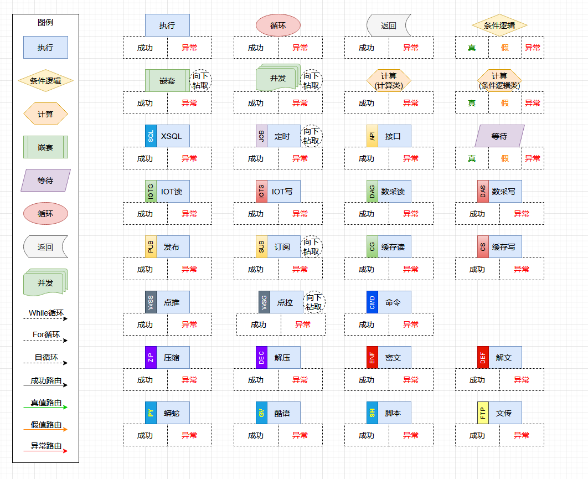
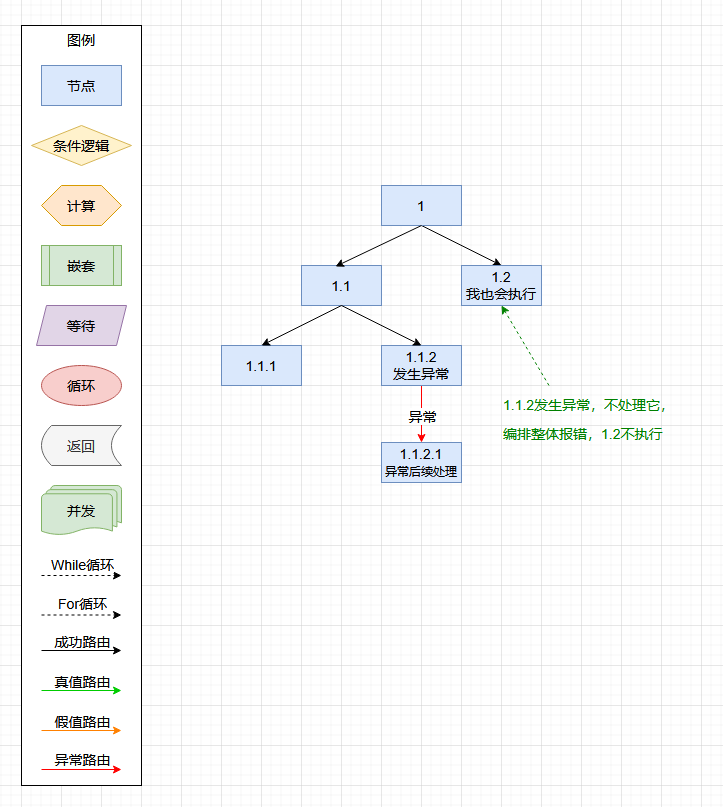
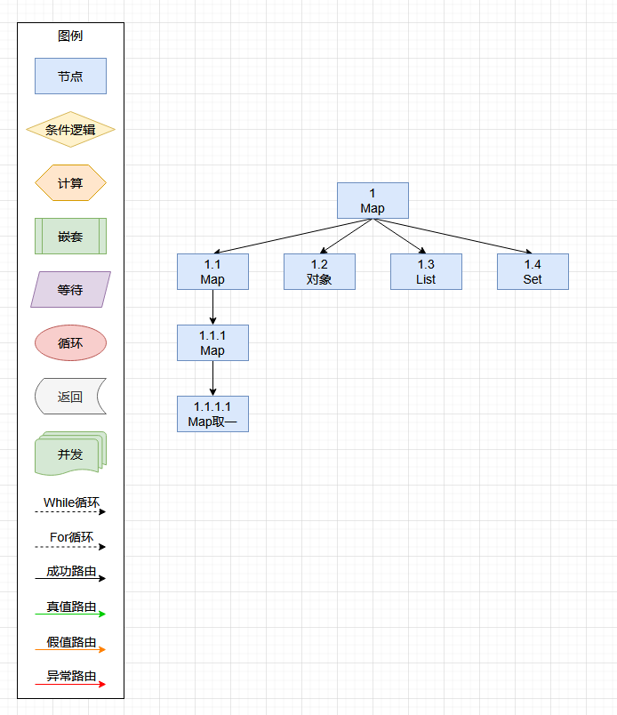
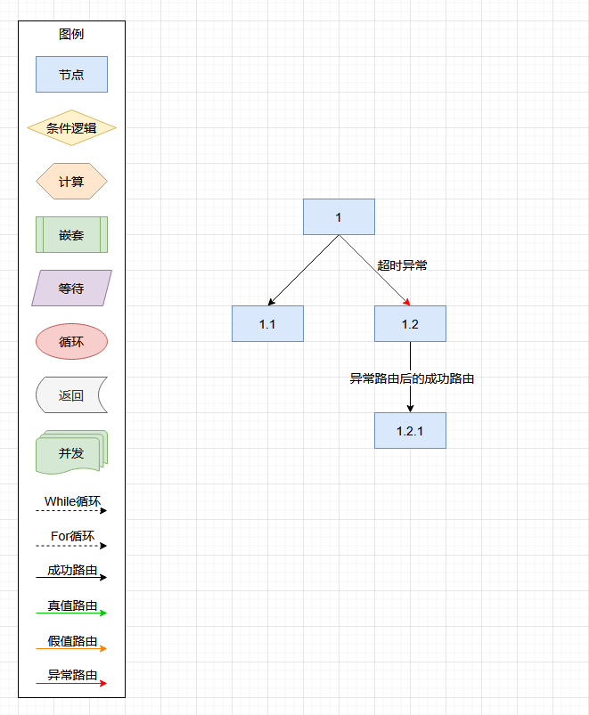
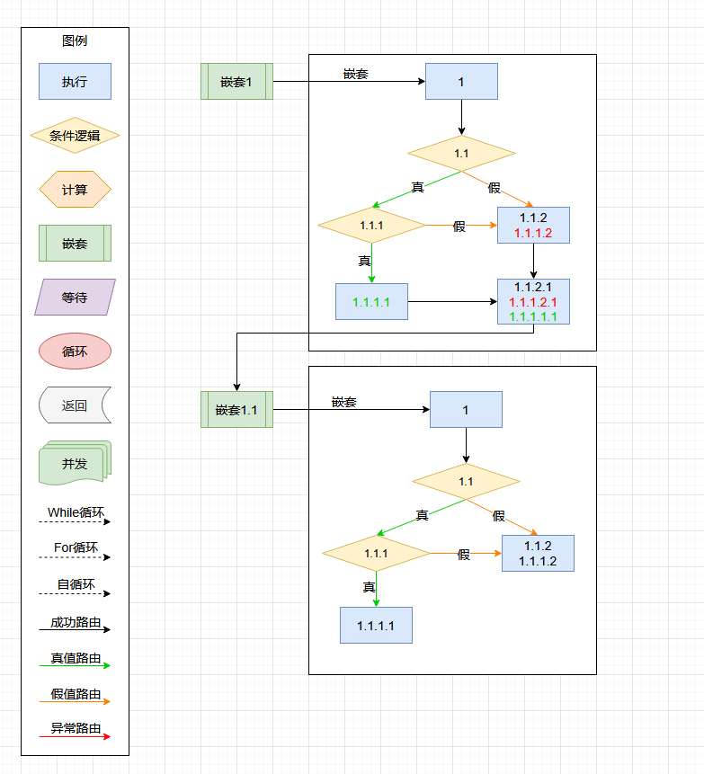
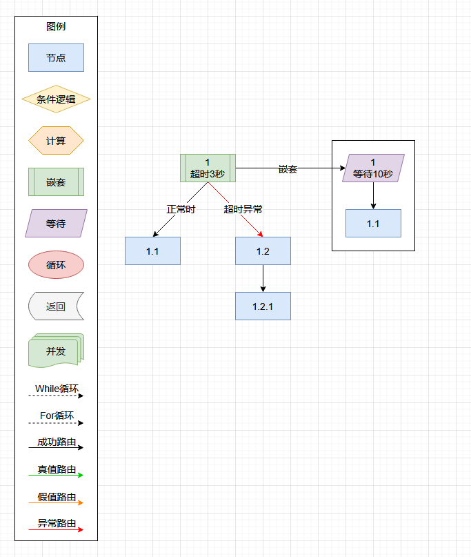
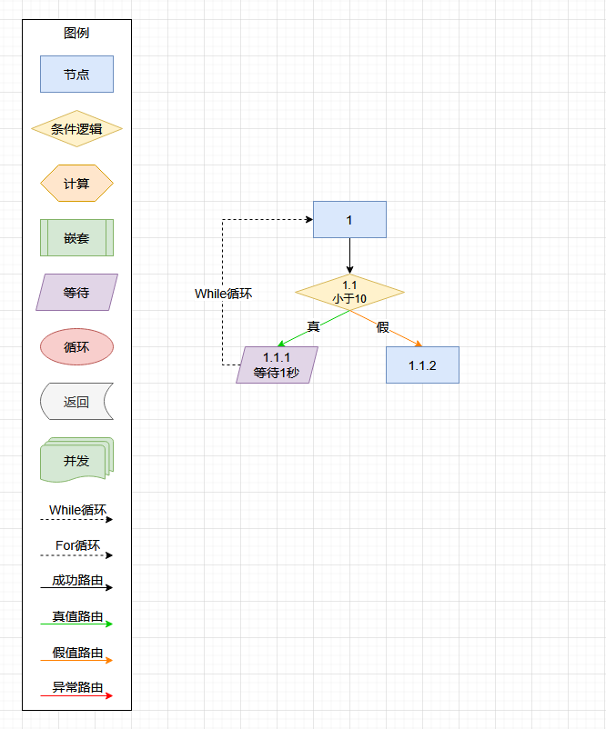
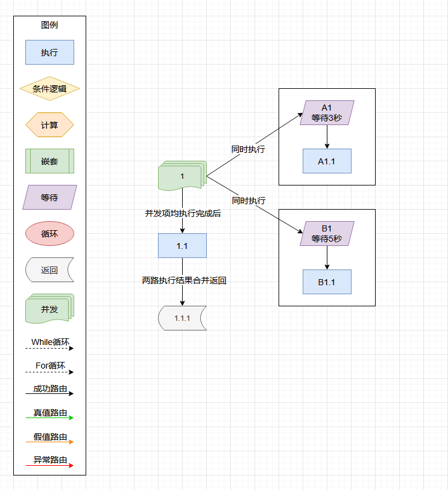
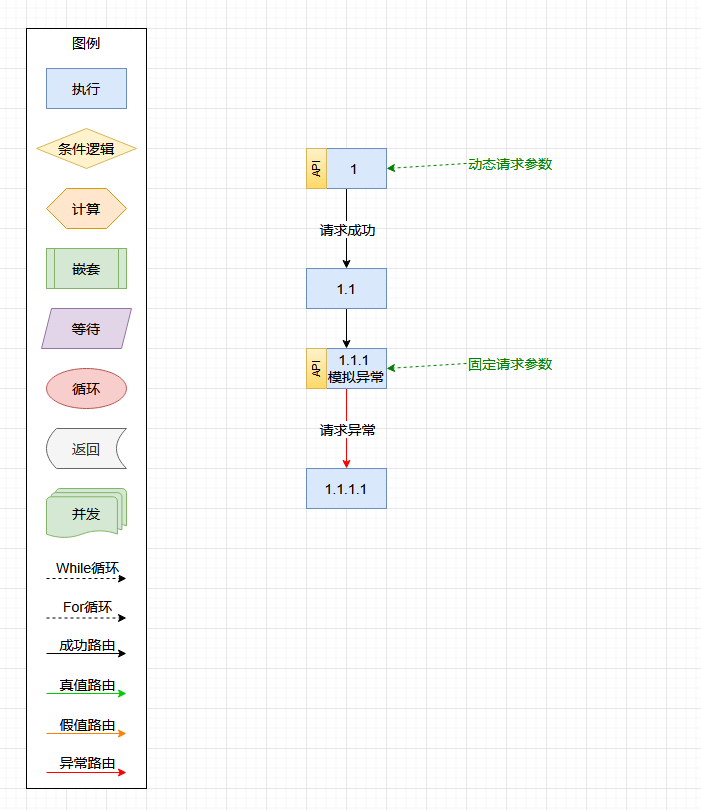

# 编排引擎 CallFlow


目录
------
* [主导思想](#主导思想)
* [概要说明](#概要说明)
* [主要方法](#主要方法)
* [元素路由总览](#元素路由总览)
* 编码示范
    * [执行前生成树信息](#执行前生成树信息)
    * [执行前的静态检查](#执行前的静态检查)
    * [编排的执行](#编排的执行)
    * [编排执行结果的轨迹](#编排执行结果的轨迹)
* 使用举例
    * [执行元素：简单编排](#执行元素举例)
    * [执行元素的多路分支和异常举例](#执行元素的多路分支和异常举例)
    * [执行元素的方法传参（Map、List、Set、对象）举例](#执行元素的方法传参举例)
    * [执行元素的超时和异常举例](#执行元素的超时和异常举例)
    * [条件逻辑元素举例](#条件逻辑元素举例)
    * [条件逻辑元素的多条件及返回对象举例](#条件逻辑元素的多条件及返回对象举例)
    * [条件逻辑元素的非空及多路径举例](#条件逻辑元素的非空及多路径举例)
    * [多路径裂变举例](#多路径裂变举例)
    * [嵌套元素举例](#嵌套元素举例)
    * [嵌套元素的嵌套多个举例](#嵌套元素的嵌套多个举例)
    * [嵌套元素的超时和异常举例](#嵌套元素的超时和异常举例)
    * [等待元素和While循环举例](#等待元素和While循环举例)
    * [计算元素和While循环举例](#计算元素和While循环举例)
    * [循环元素的For循环数列举例](#循环元素的For循环数列举例)
    * [循环元素的For循环集合和数组举例](#循环元素的For循环集合和数组举例)
    * [返回元素的举例](#返回元素的举例)
    * [递归的举例](#递归的举例)
    * [并发元素的举例](#并发元素的举例)
    * [接口元素的举例](#接口元素的举例)
    * [XSQL元素的举例](#XSQL元素的举例)
    * [定时元素的举例](#定时元素的举例)
    * [发布元素的举例](#发布元素的举例)


主导思想
------

    1. 将基础的 Java 方法灵活组合，构建特定业务逻辑。

    2. 柔性配置：组合过程无需开发，可配置、即改即用，服务无须重启。
    
    3. 可移植性：编排配置支持导出导入，便于保存、复制和升级。
    
    4. 自动化执行：只需输入数据，引擎自动执行流程并返回结果，实现“输入->执行->输出”的闭环。
    
    5. 嵌入式：编排引擎将直接嵌入业务服务中运行。
    


概要说明
------

    1. 9种编排元素（基本元素）。
    
        1.1. 执行元素，配置及执行Java方法。可轻松扩展它，衍生成特定的业务元素。
    
        1.2. 条件逻辑元素，与或逻辑判定。
    
        1.3. 计算元素，计算数据、加工数据、创建新数据。
        
        1.4. 等待元素，等待一段时间，并且有计数器功能。
    
        1.5. 循环元素，按数组、集合或数列，循环执行一个或多个其它元素。
    
        1.6. 嵌套元素，嵌套其它编排，复用与共享编排，构建更复杂的业务。
        
        1.7. 返回元素，返回数据并结束执行。在嵌套子编排中，仅结束子编排，返回到主编排继续执行。
        
        1.8. 并发元素，同时执行多个独立的编排，全都执行完成后，并发元素才视为执行完成。
        
        1.9. 定时元素，定时的周期性的驱动编排执行。
        
    2. 5种衍生元素。
    
        2.1. IOT读元素，衍生于执行元素，用于读取PLC数据。
        
        2.2. IOT写元素，衍生于执行元素，用于向PLC写入数据。
        
        2.3. 接口元素，衍生于执行元素，用于API接口请求访问。
        
        2.4. 发布元素，衍生于接口元素，支持MQTT发布消息。
        
        2.5. XSQL元素，衍生于执行元素，数据库CRUD、DDL、DML、XSQL组等操作。
        
    3. 4种编排路由。
        
        3.1 成功路由，元素执行成功时走的路。
        
        3.2 异常路由，元素执行出时异常时走的路。
        
        3.3 真值路由，条件逻辑元素、计算元素（逻辑类型）与等待元素（计数器类型），结果为真时走的路。
        
        3.4 假值路由，条件逻辑元素、计算元素（逻辑类型）与等待元素（计数器类型），结果为假时走的路。
        
    4. 2种编排循环。
        
        4.1 While循环路由，下层元素回流到上层元素时走的路。
        
        4.2 For循环路由，与循环元素配合（至少有一个），回流到循环元素的路。
        
        4.3 路由与循环可以组合后共存（12种），即：成功路由+For循环路由组成一条成功时For循环的路由。
        
    5. 常用的系统预设变量。
    
        5.1. :CallFlowContext，编排实例ID的变量名称。
        
        5.2. :CallFlowContext，编排实例上下文的变量名称。它作为参数向Java方法传参，可读可写其内容。
        
        5.3. :CallFlowErrorResult，编排实例异常的变量名称。仅最后一次异常的信息。


主要方法
------

|方法|说明|
|:--------|:--------|
|CallFlow.execute(IExecute ,Map)|执行编排|
|CallFlow.execute(IExecute ,Map ,IExecuteEvent)|执行编排，并带有事件监听器的|
|CallFlow.getHelpCheck(IExecute)|编排的静态合规性检测|
|CallFlow.getHelpExecute().calcTree(IExecute)|计算寻址相关的树ID|
|CallFlow.getHelpExecute().clearTree(IExecute)|清理寻址相关的树ID|
|CallFlow.getHelpExecute().findTreeID(IExecute ,String)|用树ID定位编排中的元素|
|CallFlow.getHelpExecute().findFirst(IExecute)|定位编排中的首个元素|
|CallFlow.getHelpExport().export(IExecute)|导出编排配置|
|CallFlow.getHelpExport().save(IExecute)|导出编排配置，并保存为文件|
|CallFlow.getHelpExport().save(IExecute ,String)|导出编排配置，并保存在指定目录中|
|CallFlow.getHelpImport().imports(String)|导入编排配置|
|CallFlow.getHelpImport().upgradeBackupFile(IExecute ,String)|升级编排配置，并备份原编排为文件|
|CallFlow.getHelpImport().upgradeBackupString(IExecute ,String)|升级编排配置，并备份原编排为文本字符|
|CallFlow.getHelpLog().logs(ExecuteResult)|生成执行结果的轨迹日志|
|CallFlow.getHelpClone().clone(IExecute)|深度克隆编排|


元素路由总览
------

执行元素有两种路由，成功时的成功路由和异常时的异常路由。

条件逻辑元素有三种路由，判定为真时的真值路由、判定为假时的假值路由和异常时的异常路由。

计算元素比较特殊，有两种情况：

    当它为计算类型时，有成功路由和异常路由。

    当它为条件逻辑类型时，有真、假和异常三种路由。




执行前生成树信息
------
```java
// 获取编排中的首个元素
NodeConfig v_FirstNode = (NodeConfig) XJava.getObject("XNode_CF001_1");

// 编排结构未变时，仅须生成一次树ID
CallFlow.getHelpExecute().clearTree(v_FirstNode);  // 清空树ID及寻址相关的信息
CallFlow.getHelpExecute().calcTree(v_FirstNode);   // 计算树ID及寻址相关的信息
```


执行前的静态检查
------
```java
// 获取编排中的首个元素
NodeConfig     v_FirstNode = (NodeConfig) XJava.getObject("XNode_CF001_1");

// 执行前的静态检查（关键属性未变时，check方法内部为快速检查）
Return<Object> v_CheckRet  = CallFlow.getHelpCheck().check(v_FirstNode);
if ( !v_CheckRet.get() )
{
    System.out.println(v_CheckRet.getParamStr());  // 打印不合格的原因
    return;
}
```


编排的执行
------
```java
// 获取编排中的首个元素
NodeConfig          v_FirstNode = (NodeConfig) XJava.getObject("XNode_CF001_1");

// 初始化上下文（可从中方便的获取中间运算信息，也可传NULL）
Map<String ,Object> v_Context   = new HashMap<String ,Object>();

// 执行编排。返回执行结果       
ExecuteResult       v_Result    = CallFlow.execute(v_FirstNode ,v_Context);
```


编排执行结果的轨迹
------
```java
// 执行编排。返回执行结果       
ExecuteResult v_Result = CallFlow.execute(v_FirstNode ,v_Context);
if ( v_Result.isSuccess() )
{
    System.out.println("Success");
}
else
{
    System.out.println("Error XID = " + v_Result.getExecuteXID());
    v_Result.getException().printStackTrace();  // 打印异常
}

// 打印执行路径（从首个执行的元素开始打印）
ExecuteResult v_FirstResult = CallFlow.getFirstResult(v_Context);
System.out.println(CallFlow.getHelpLog().logs(v_FirstResult));
```


执行元素举例
------

[查看代码](src/test/java/org/hy/common/callflow/junit/cflow001) [返回目录](#目录)

__编排图例演示__


__编排配置__

```xml
<?xml version="1.0" encoding="UTF-8"?>

<config>

    <import name="xconfig"    class="java.util.ArrayList" />
    <import name="xmt"        class="org.hy.common.callflow.nesting.MTConfig" />
    <import name="xnesting"   class="org.hy.common.callflow.nesting.NestingConfig" />
    <import name="xfor"       class="org.hy.common.callflow.forloop.ForConfig" />
    <import name="xnode"      class="org.hy.common.callflow.node.NodeConfig" />
    <import name="xwait"      class="org.hy.common.callflow.node.WaitConfig" />
    <import name="xcalculate" class="org.hy.common.callflow.node.CalculateConfig" />
    <import name="xcondition" class="org.hy.common.callflow.ifelse.ConditionConfig" />
    <import name="xreturn"    class="org.hy.common.callflow.returns.ReturnConfig" />
    <import name="xapi"       class="org.hy.common.callflow.node.APIConfig" />
    <import name="xpublish"   class="org.hy.common.callflow.event.PublishConfig" />
    <import name="xsql"       class="org.hy.common.callflow.node.XSQLConfig" />
    <import name="xjob"       class="org.hy.common.callflow.event.JOBConfig" />
    
    
    
    <!-- CFlow编排引擎配置 -->
    <xconfig>
        
        <xnode id="XNode_CF001_1_1">
            <comment>节点002，后面节点配置在XML前</comment>
            <callXID>:XProgram</callXID>
            <callMethod>method002</callMethod>
        </xnode>
        
        
        <xnode id="XNode_CF001_1">
            <comment>节点001</comment>
            <callXID>:XProgram</callXID>                    <!-- 定义执行对象 -->
            <callMethod>method001</callMethod>              <!-- 定义执行方法 -->
            <route>
                <succeed>                                   <!-- 成功时，关联后置节点 -->
                    <next ref="XNode_CF001_1_1" />
                    <comment>成功时</comment>
                </succeed>
            </route>
        </xnode>
        
    </xconfig>
    
</config>
```

__执行编排__

```java
// 初始化被编排的执行对象方法（按业务需要）
XJava.putObject("XProgram" ,new Program());
        
// 获取编排中的首个元素
NodeConfig          v_FirstNode = (NodeConfig) XJava.getObject("XNode_CF001_1");

// 初始化上下文（可从中方便的获取中间运算信息，也可传NULL）
Map<String ,Object> v_Context   = new HashMap<String ,Object>();

// 执行编排。返回执行结果       
ExecuteResult       v_Result    = CallFlow.execute(v_FirstNode ,v_Context);
```


执行元素的多路分支和异常举例
------

[查看代码](src/test/java/org/hy/common/callflow/junit/cflow005) [返回目录](#目录)

__编排图例演示__



__编排配置__

```xml
<?xml version="1.0" encoding="UTF-8"?>

<config>

    <import name="xconfig"    class="java.util.ArrayList" />
    <import name="xmt"        class="org.hy.common.callflow.nesting.MTConfig" />
    <import name="xnesting"   class="org.hy.common.callflow.nesting.NestingConfig" />
    <import name="xfor"       class="org.hy.common.callflow.forloop.ForConfig" />
    <import name="xnode"      class="org.hy.common.callflow.node.NodeConfig" />
    <import name="xwait"      class="org.hy.common.callflow.node.WaitConfig" />
    <import name="xcalculate" class="org.hy.common.callflow.node.CalculateConfig" />
    <import name="xcondition" class="org.hy.common.callflow.ifelse.ConditionConfig" />
    <import name="xreturn"    class="org.hy.common.callflow.returns.ReturnConfig" />
    <import name="xapi"       class="org.hy.common.callflow.node.APIConfig" />
    <import name="xpublish"   class="org.hy.common.callflow.event.PublishConfig" />
    <import name="xsql"       class="org.hy.common.callflow.node.XSQLConfig" />
    <import name="xjob"       class="org.hy.common.callflow.event.JOBConfig" />
    
    
    
    <!-- CFlow编排引擎配置 -->
    <xconfig>
    
        <xnode id="XNode_CF005_1_2">
            <comment>1.2节点。异常时有后续的处理，我也会被执行</comment>
            <callXID>:XProgram</callXID>
            <callMethod>method_1_2</callMethod>
        </xnode>
        
        
        <xnode id="XNode_CF005_1_1_2_1">
            <comment>异常时的后续处理</comment>
            <callXID>:XProgram</callXID>
            <callMethod>method_Error</callMethod>
        </xnode>
        
        
        <xnode id="XNode_CF005_1_1_2">
            <comment>1.1.2节点</comment>
            <callXID>:XProgram</callXID>
            <callMethod>method_1_1_2</callMethod>
            <route>
                <error>                                     <!-- 异常时，关联后置节点 -->
                    <next ref="XNode_CF005_1_1_2_1" />
                    <comment>异常时</comment>
                </error>
            </route>
        </xnode>
        
        
        <xnode id="XNode_CF005_1_1_1">
            <comment>1.1.1节点</comment>
            <callXID>:XProgram</callXID>
            <callMethod>method_1_1_1</callMethod>
        </xnode>
    
    
        <xnode id="XNode_CF005_1_1">
            <comment>1.1节点</comment>
            <callXID>:XProgram</callXID>
            <callMethod>method_1_1</callMethod>
            <route>
                <succeed>                                   <!-- 成功时，关联后置节点 -->
                    <next ref="XNode_CF005_1_1_1" />
                    <comment>成功时，第一路</comment>
                </succeed>
                <succeed>                                   <!-- 成功时，关联后置节点 -->
                    <next ref="XNode_CF005_1_1_2" />
                    <comment>成功时，第二路</comment>
                </succeed>
            </route>
        </xnode>
        
        
        <xnode id="XNode_CF005_1">
            <comment>1节点</comment>
            <callXID>:XProgram</callXID>
            <callMethod>method_1</callMethod>
            <route>
                <succeed>                                   <!-- 成功时，关联后置节点 -->
                    <next ref="XNode_CF005_1_1" />
                    <comment>成功时，第一路</comment>
                </succeed>
                <succeed>                                   <!-- 成功时，关联后置节点 -->
                    <next ref="XNode_CF005_1_2" />
                    <comment>成功时，第二路</comment>
                </succeed>
            </route>
        </xnode>
        
    </xconfig>
    
</config>
```

__执行编排__

```java
// 初始化被编排的执行对象方法（按业务需要）
XJava.putObject("XProgram" ,new Program());
        
// 获取编排中的首个元素
NodeConfig          v_FirstNode = (NodeConfig) XJava.getObject("XNode_CF005_1");

// 初始化上下文（可从中方便的获取中间运算信息，也可传NULL）
Map<String ,Object> v_Context   = new HashMap<String ,Object>();

// 执行编排。返回执行结果       
ExecuteResult       v_Result    = CallFlow.execute(v_FirstNode ,v_Context);
```


执行元素的方法传参举例
------

[查看代码](src/test/java/org/hy/common/callflow/junit/cflow014) [返回目录](#目录)

__编排图例演示__



__编排配置__

```xml
<?xml version="1.0" encoding="UTF-8"?>

<config>

    <import name="xconfig"    class="java.util.ArrayList" />
    <import name="xmt"        class="org.hy.common.callflow.nesting.MTConfig" />
    <import name="xnesting"   class="org.hy.common.callflow.nesting.NestingConfig" />
    <import name="xfor"       class="org.hy.common.callflow.forloop.ForConfig" />
    <import name="xnode"      class="org.hy.common.callflow.node.NodeConfig" />
    <import name="xwait"      class="org.hy.common.callflow.node.WaitConfig" />
    <import name="xcalculate" class="org.hy.common.callflow.node.CalculateConfig" />
    <import name="xcondition" class="org.hy.common.callflow.ifelse.ConditionConfig" />
    <import name="xreturn"    class="org.hy.common.callflow.returns.ReturnConfig" />
    <import name="xapi"       class="org.hy.common.callflow.node.APIConfig" />
    <import name="xpublish"   class="org.hy.common.callflow.event.PublishConfig" />
    <import name="xsql"       class="org.hy.common.callflow.node.XSQLConfig" />
    <import name="xjob"       class="org.hy.common.callflow.event.JOBConfig" />
    
    
    
    <!-- CFlow编排引擎配置 -->
    <xconfig>
    
        <xnode id="XNode_CF014_1_4">
            <comment>方法入参数是Set集合</comment>
            <callXID>:XProgram</callXID>                    <!-- 定义执行对象 -->
            <callMethod>method_Set</callMethod>             <!-- 定义执行方法 -->
            <callParam>                                     <!-- 定义入参类型 -->
                <value>:ObjectData.hashSetData</value>      <!-- 支持面向对象xx.yy.zz，并且不用定义入参的元类型 -->
            </callParam>
        </xnode>
        
        
        <xnode id="XNode_CF014_1_3">
            <comment>方法入参数是List集合</comment>
            <callXID>:XProgram</callXID>                    <!-- 定义执行对象 -->
            <callMethod>method_List</callMethod>            <!-- 定义执行方法 -->
            <callParam>                                     <!-- 定义入参类型 -->
                <value>:ObjectData.listData</value>         <!-- 支持面向对象xx.yy.zz，并且不用定义入参的元类型 -->
            </callParam>
        </xnode>
        
    
        <xnode id="XNode_CF014_1_2">
            <comment>方法入参数是对象</comment>
            <callXID>:XProgram</callXID>                    <!-- 定义执行对象 -->
            <callMethod>method_Object</callMethod>          <!-- 定义执行方法 -->
            <callParam>                                     <!-- 定义入参类型 -->
                <valueClass>org.hy.common.callflow.junit.cflow014.program.Program</valueClass>      
                <value>                                     <!-- 定义入参默认值 -->
                {
                    "name": "CallFlow",
                    "age": 1,
                    "birthday": "2025-02-07",
                    "listData" : [
                        "6元素",
                        "4路由",
                        "2循环"
                    ],
                    "hashSetData" : [
                        "成功路由",
                        "异常路由",
                        "真值路由",
                        "假值路由"
                    ]
                }
                </value>
            </callParam>
            <returnID>ObjectData</returnID>                 <!-- 定义返回结果的变量名称 -->
        </xnode>
        
        
        <xnode id="XCondition_CF004_1_1_1_1">
            <comment>取Map中的元素值</comment>
            <callXID>:XProgram</callXID>                    <!-- 定义执行对象 -->
            <callMethod>method_String</callMethod>          <!-- 定义执行方法 -->
            <callParam>
                <value>:MapDatas.狗</value>                 <!-- 支持面向对象xx.yy.zz，从Map中取一个元素 -->
            </callParam>
        </xnode>
    
    
        <xnode id="XNode_CF014_1_1_1">
            <comment>方法入参数是Map集合，数值传值</comment>
            <callXID>:XProgram</callXID>                    <!-- 定义执行对象 -->
            <callMethod>method_Map</callMethod>             <!-- 定义执行方法 -->
            <callParam>
                <valueClass>java.util.Map</valueClass>      <!-- 定义入参类型 -->
                <value>                                     <!-- 定义入参默认值 -->
                {
                    "狗": "忠诚",
                    "猫": "独立",
                    "鱼": "宁静"
                }
                </value>
            </callParam>
            <returnID>MapDatas</returnID>
            <route>
                <succeed>                                   <!-- 成功时，关联后置节点 -->
                    <next ref="XCondition_CF004_1_1_1_1" />
                    <comment>成功时</comment>
                </succeed>
            </route>
        </xnode>
        
    
        <xnode id="XNode_CF014_1_1">
            <comment>方法入参数是Map集合，默认值传值</comment>
            <callXID>:XProgram</callXID>                    <!-- 定义执行对象 -->
            <callMethod>method_Map</callMethod>             <!-- 定义执行方法 -->
            <callParam>
                <valueClass>java.util.Map</valueClass>      <!-- 定义入参类型 -->
                <!-- 不设定入参变量名称，可用默认值代替 -->
                <valueDefault>                              <!-- 定义入参默认值 -->
                {
                    "张三": "23",
                    "李四": "24",
                    "王五": "25"
                }
                </valueDefault>
            </callParam>
            <route>
                <succeed>                                   <!-- 成功时，关联后置节点 -->
                    <next ref="XNode_CF014_1_1_1" />
                    <comment>成功时</comment>
                </succeed>
            </route>
        </xnode>
        
        
        <xnode id="XNode_CF014_1">
            <comment>方法入参数是Map集合，系统预设变量传值</comment>
            <callXID>:XProgram</callXID>                    <!-- 定义执行对象 -->
            <callMethod>method_Map</callMethod>             <!-- 定义执行方法 -->
            <callParam>
                <valueClass>java.util.Map</valueClass>      <!-- 定义入参类型。占位符变量时，可免定义 -->
                <value>:CallFlowContext</value>             <!-- 系统预设的上下文内容变量名称 -->
            </callParam>
            <route>
                <succeed>                                   <!-- 成功时，关联后置节点 -->
                    <next ref="XNode_CF014_1_1" />
                    <comment>第一个分支</comment>
                </succeed>
                <succeed>                                   <!-- 成功时，关联后置节点 -->
                    <next ref="XNode_CF014_1_2" />
                    <comment>第二个分支</comment>
                </succeed>
                <succeed>                                   <!-- 成功时，关联后置节点 -->
                    <next ref="XNode_CF014_1_3" />
                    <comment>第三个分支</comment>
                </succeed>
                <succeed>                                   <!-- 成功时，关联后置节点 -->
                    <next ref="XNode_CF014_1_4" />
                    <comment>第四个分支</comment>
                </succeed>
            </route>
        </xnode>
        
    </xconfig>
    
</config>
```

__执行编排__

```java
// 初始化被编排的执行对象方法（按业务需要）
XJava.putObject("XProgram" ,new Program());
        
// 获取编排中的首个元素
NodeConfig          v_FirstNode = (NodeConfig) XJava.getObject("XNode_CF014_1");

// 初始化上下文（可从中方便的获取中间运算信息，也可传NULL）
Map<String ,Object> v_Context   = new HashMap<String ,Object>();

// 执行编排。返回执行结果       
ExecuteResult       v_Result    = CallFlow.execute(v_FirstNode ,v_Context);
```


执行元素的超时和异常举例
------

[查看代码](src/test/java/org/hy/common/callflow/junit/cflow013) [返回目录](#目录)

__编排图例演示__



__编排配置__

```xml
<?xml version="1.0" encoding="UTF-8"?>

<config>

    <import name="xconfig"    class="java.util.ArrayList" />
    <import name="xmt"        class="org.hy.common.callflow.nesting.MTConfig" />
    <import name="xnesting"   class="org.hy.common.callflow.nesting.NestingConfig" />
    <import name="xfor"       class="org.hy.common.callflow.forloop.ForConfig" />
    <import name="xnode"      class="org.hy.common.callflow.node.NodeConfig" />
    <import name="xwait"      class="org.hy.common.callflow.node.WaitConfig" />
    <import name="xcalculate" class="org.hy.common.callflow.node.CalculateConfig" />
    <import name="xcondition" class="org.hy.common.callflow.ifelse.ConditionConfig" />
    <import name="xreturn"    class="org.hy.common.callflow.returns.ReturnConfig" />
    <import name="xapi"       class="org.hy.common.callflow.node.APIConfig" />
    <import name="xpublish"   class="org.hy.common.callflow.event.PublishConfig" />
    <import name="xsql"       class="org.hy.common.callflow.node.XSQLConfig" />
    <import name="xjob"       class="org.hy.common.callflow.event.JOBConfig" />
    
    
    
    <!-- CFlow编排引擎配置 -->
    <xconfig>
    
        <xnode id="XNode_CF013_1_2_1">
            <comment>异常路由后的成功路由后的子元素的执行</comment>
            <callXID>:XProgram</callXID>                    <!-- 定义执行对象 -->
            <callMethod>method_Error_Finish</callMethod>    <!-- 定义执行方法 -->
        </xnode>
        
        
        <xnode id="XNode_CF013_1_2">
            <comment>超时异常情况</comment>
            <callXID>:XProgram</callXID>                    <!-- 定义执行对象 -->
            <callMethod>method_Error</callMethod>           <!-- 定义执行方法 -->
            <route>
                <succeed>                                   <!-- 成功时，关联后置节点 -->
                    <next ref="XNode_CF013_1_2_1" />
                    <comment>成功时</comment>
                </succeed>
            </route>
        </xnode>
    
        
        <xnode id="XNode_CF013_1_1">
            <comment>正常情况</comment>
            <callXID>:XProgram</callXID>                    <!-- 定义执行对象 -->
            <callMethod>method_OK</callMethod>              <!-- 定义执行方法 -->
            <callParam>
                <valueClass>java.lang.Long</valueClass>     <!-- 定义入参类型 -->
                <value>:TimeLen</value>                     <!-- 定义入参变量名称 -->
            </callParam>
        </xnode>
        
        
        <xnode id="XNode_CF013_1">
            <comment>模拟超时</comment>
            <callXID>:XProgram</callXID>                    <!-- 定义执行对象 -->
            <callMethod>method_Timeout</callMethod>         <!-- 定义执行方法 -->
            <timeout>5000</timeout>                         <!-- 执行超时时长（单位：毫秒） -->
            <callParam>
                <valueClass>java.lang.Long</valueClass>     <!-- 定义入参类型 -->
                <value>:SleepTime</value>                   <!-- 定义入参变量名称 -->
            </callParam>
            <returnID>TimeLen</returnID>                    <!-- 定义返回结果的变量名称 -->
            <route>
                <succeed>                                   <!-- 成功时，关联后置节点 -->
                    <next ref="XNode_CF013_1_1" />
                    <comment>成功时</comment>
                </succeed>
                <error>                                     <!-- 异常时，关联后置节点 -->
                    <next ref="XNode_CF013_1_2" />
                    <comment>超时异常时</comment>
                </error>
            </route>
        </xnode>
        
    </xconfig>
    
</config>
```

__执行编排__

```java
// 初始化被编排的执行对象方法（按业务需要）
XJava.putObject("XProgram" ,new Program());
        
// 获取编排中的首个元素
NodeConfig          v_FirstNode = (NodeConfig) XJava.getObject("XNode_CF013_1");

// 初始化上下文（可从中方便的获取中间运算信息，也可传NULL）
Map<String ,Object> v_Context   = new HashMap<String ,Object>();
v_Context.put("SleepTime" ,1000L * 100L);  // 大于5秒 或 小于5秒

// 执行编排。返回执行结果       
ExecuteResult       v_Result    = CallFlow.execute(v_FirstNode ,v_Context);
```


条件逻辑元素举例
------

[查看代码](src/test/java/org/hy/common/callflow/junit/cflow002) [返回目录](#目录)

__编排图例演示__


__编排配置__

```xml
<?xml version="1.0" encoding="UTF-8"?>

<config>

    <import name="xconfig"    class="java.util.ArrayList" />
    <import name="xmt"        class="org.hy.common.callflow.nesting.MTConfig" />
    <import name="xnesting"   class="org.hy.common.callflow.nesting.NestingConfig" />
    <import name="xfor"       class="org.hy.common.callflow.forloop.ForConfig" />
    <import name="xnode"      class="org.hy.common.callflow.node.NodeConfig" />
    <import name="xwait"      class="org.hy.common.callflow.node.WaitConfig" />
    <import name="xcalculate" class="org.hy.common.callflow.node.CalculateConfig" />
    <import name="xcondition" class="org.hy.common.callflow.ifelse.ConditionConfig" />
    <import name="xreturn"    class="org.hy.common.callflow.returns.ReturnConfig" />
    <import name="xapi"       class="org.hy.common.callflow.node.APIConfig" />
    <import name="xpublish"   class="org.hy.common.callflow.event.PublishConfig" />
    <import name="xsql"       class="org.hy.common.callflow.node.XSQLConfig" />
    <import name="xjob"       class="org.hy.common.callflow.event.JOBConfig" />
    
    
    
    <!-- CFlow编排引擎配置 -->
    <xconfig>
    
        <xnode id="XNode_CF002_1_1_2">
            <comment>第三个环节，为假时的走向</comment>
            <callXID>:XProgram</callXID>
            <callMethod>method_False</callMethod>
        </xnode>
        
        
        <xnode id="XNode_CF002_1_1_1">
            <comment>第三个环节，为真时的走向</comment>
            <callXID>:XProgram</callXID>
            <callMethod>method_True</callMethod>
        </xnode>
        
        
        <xcondition id="XCondition_CF002_1_1">
            <comment>第二个环节，条件逻辑，按第一个环节的执行结果（真、假）控制编排的走向</comment>
            <logical>AND</logical>                          <!-- 判定逻辑（可以不用显式定义。默认为AND） -->
            <conditionItem>
                <valueClass>java.lang.String</valueClass>   <!-- 定义变量类型 -->
                <valueXIDA>T</valueXIDA>                    <!-- 默认值 -->
                <comparer>==</comparer>                     <!-- 判定比较器（可以不用显式定义。默认为==） -->
                <valueXIDB>:IfElse</valueXIDB>              <!-- 变量 -->
            </conditionItem>
            <route>
                <if>                                        <!-- 真时的路由 -->
                    <next ref="XNode_CF002_1_1_1" />
                    <comment>真时</comment>
                </if>
                <else>                                      <!-- 假时的路由 -->
                    <next ref="XNode_CF002_1_1_2" />
                    <comment>假时</comment>
                </else>
            </route>
        </xcondition>
        
        
        <xnode id="XNode_CF002_1">
            <comment>第一个环节，有一个参数，有返回结果</comment>
            <callXID>:XProgram</callXID>
            <callMethod>method_First</callMethod>
            <callParam>
                <valueClass>java.lang.Integer</valueClass>  <!-- 定义入参类型 -->
                <value>:NumParam</value>                    <!-- 定义入参变量名称 -->
                <valueDefault>-1</valueDefault>             <!-- 定义入参默认值 -->
            </callParam>
            <returnID>IfElse</returnID>                     <!-- 定义返回结果的变量名称 -->
            <route>
                <succeed>                                   <!-- 成功时，关联后置节点 -->
                    <next ref="XCondition_CF002_1_1" />
                    <comment>成功时</comment>
                </succeed>
            </route>
        </xnode>
        
    </xconfig>
    
</config>
```

__执行编排__

```java
// 初始化被编排的执行对象方法（按业务需要）
XJava.putObject("XProgram" ,new Program());
        
// 获取编排中的首个元素
NodeConfig          v_FirstNode = (NodeConfig) XJava.getObject("XNode_CF002_1");

// 初始化上下文（可从中方便的获取中间运算信息，也可传NULL）
Map<String ,Object> v_Context   = new HashMap<String ,Object>();
v_Context.put("NumParam" ,9);  // 传值 9 或 传值 -1 或 不传值

// 执行编排。返回执行结果       
ExecuteResult       v_Result    = CallFlow.execute(v_FirstNode ,v_Context);
```


条件逻辑元素的多条件及返回对象举例
------

[查看代码](src/test/java/org/hy/common/callflow/junit/cflow004) [返回目录](#目录)

__编排图例演示__


__编排配置__

```xml
<?xml version="1.0" encoding="UTF-8"?>

<config>

    <import name="xconfig"    class="java.util.ArrayList" />
    <import name="xmt"        class="org.hy.common.callflow.nesting.MTConfig" />
    <import name="xnesting"   class="org.hy.common.callflow.nesting.NestingConfig" />
    <import name="xfor"       class="org.hy.common.callflow.forloop.ForConfig" />
    <import name="xnode"      class="org.hy.common.callflow.node.NodeConfig" />
    <import name="xwait"      class="org.hy.common.callflow.node.WaitConfig" />
    <import name="xcalculate" class="org.hy.common.callflow.node.CalculateConfig" />
    <import name="xcondition" class="org.hy.common.callflow.ifelse.ConditionConfig" />
    <import name="xreturn"    class="org.hy.common.callflow.returns.ReturnConfig" />
    <import name="xapi"       class="org.hy.common.callflow.node.APIConfig" />
    <import name="xpublish"   class="org.hy.common.callflow.event.PublishConfig" />
    <import name="xsql"       class="org.hy.common.callflow.node.XSQLConfig" />
    <import name="xjob"       class="org.hy.common.callflow.event.JOBConfig" />
    
    
    
    <!-- CFlow编排引擎配置 -->
    <xconfig>
    
        <xnode id="XNode_CF004_1_1_2_2">
            <comment>第六个环节，大于等于10的走向</comment>
            <callXID>:XProgram</callXID>
            <callMethod>method_Less_10</callMethod>
        </xnode>
    
    
        <xnode id="XNode_CF004_1_1_2_1">
            <comment>第五个环节，大于等于10的走向</comment>
            <callXID>:XProgram</callXID>
            <callMethod>method_Greater_10</callMethod>
        </xnode>
        
        
        <!-- 条件逻辑表达式为：2.0D >= 10.0D  -->
        <xcondition id="XCondition_CF004_1_1_2">
            <comment>第四个环节，条件逻辑，是否大于等于</comment>
            <logical>AND</logical>
            <conditionItem>
                <valueClass>java.lang.Double</valueClass>
                <valueXIDA>:ObjectRet.doubleValue</valueXIDA>
                <comparer><![CDATA[>=]]></comparer>
                <valueXIDB>10</valueXIDB>
            </conditionItem>
            <route>
                <if>                                        <!-- 真时的路由 -->
                    <next ref="XNode_CF004_1_1_2_1" />
                    <comment>真时</comment>
                </if>
                <else>                                      <!-- 假时的路由 -->
                    <next ref="XNode_CF004_1_1_2_2" />
                    <comment>假时</comment>
                </else>
            </route>
        </xcondition>
        
        
        <xnode id="XNode_CF004_1_1_1">
            <comment>第三个环节，默认值或空值的走向</comment>
            <callXID>:XProgram</callXID>
            <callMethod>method_Default_Null</callMethod>
        </xnode>
        
        
        <!-- 条件逻辑表达式为：
        (2025-02-25 00:00:00 == NULL OR 2.0D == NULL) OR (2025-02-25 00:00:00 == 2025-02-25 00:00:00 AND 2.0D == 3.1415926D) -->
        <xcondition id="XCondition_CF004_1_1">
            <comment>第二个环节，条件逻辑，按第一个环节的执行结果控制编排的走向</comment>
            <logical>OR</logical>                               <!-- 判定逻辑（可以不用显式定义。默认为AND） -->
            <condition>
                <logical>OR</logical>
                <conditionItem>
                    <valueXIDA>:ObjectRet.timeValue</valueXIDA> <!-- 面向对象的变量 -->
                </conditionItem>
                <conditionItem>
                    <valueXIDA>:ObjectRet.doubleValue</valueXIDA>
                </conditionItem>
            </condition>
            
            <condition>
                <logical>AND</logical>
                <conditionItem>
                    <valueClass>org.hy.common.Date</valueClass> <!-- 定义入参类型 -->
                    <valueXIDA>:ObjectRet.timeValue</valueXIDA> <!-- 面向对象的变量 -->
                    <comparer>==</comparer>                     <!-- 判定比较器（可以不用显式定义。默认为==） -->
                    <valueXIDB>2025-02-25</valueXIDB>           <!-- 数值常量 -->
                </conditionItem>
                <conditionItem>
                    <valueClass>java.lang.Double</valueClass>
                    <valueXIDA>:ObjectRet.doubleValue</valueXIDA>
                    <comparer>==</comparer>
                    <valueXIDB>3.1415926</valueXIDB>
                </conditionItem>
            </condition>
            
            <route>
                <if>                                        <!-- 真时的路由 -->
                    <next ref="XNode_CF004_1_1_1" />
                    <comment>真时</comment>
                </if>
                <else>                                      <!-- 假时的路由 -->
                    <next ref="XCondition_CF004_1_1_2" />
                    <comment>假时</comment>
                </else>
            </route>
        </xcondition>
        
        
        <xnode id="XNode_CF004_1">
            <comment>第一个环节，有两个参数，有返回结果</comment>
            <callXID>:XProgram</callXID>
            <callMethod>method_First</callMethod>
            <callParam>
                <valueClass>org.hy.common.Date</valueClass> <!-- 定义入参01类型 -->
                <value>:TimeParam</value>                   <!-- 定义入参01变量名称 -->
                <valueDefault>2025-02-25</valueDefault>     <!-- 定义入参01默认值 -->
            </callParam>
            <callParam>
                <valueClass>java.lang.Double</valueClass>   <!-- 定义入参02类型 -->
                <value>:DoubleParam</value>                 <!-- 定义入参02变量名称 -->
            </callParam>
            <returnID>ObjectRet</returnID>                  <!-- 定义返回结果的变量名称 -->
            <route>
                <succeed>                                   <!-- 成功时，关联后置节点 -->
                    <next ref="XCondition_CF004_1_1" />
                    <comment>成功时</comment>
                </succeed>
            </route>
        </xnode>
        
    </xconfig>
    
</config>
```

__执行编排__

```java
// 初始化被编排的执行对象方法（按业务需要）
XJava.putObject("XProgram" ,new Program());
        
// 获取编排中的首个元素
NodeConfig          v_FirstNode = (NodeConfig) XJava.getObject("XNode_CF004_1");

// 初始化上下文（可从中方便的获取中间运算信息，也可传NULL）
Map<String ,Object> v_Context   = new HashMap<String ,Object>();
v_Context.put("DoubleParam" ,null);  // 传值大于PI 或 等于PI 或 小于PI 或 NULL
v_Context.put("TimeParam"   ,null);  // 传值 NULL 或 2025-02-25 或 其它时间

// 执行编排。返回执行结果       
ExecuteResult       v_Result    = CallFlow.execute(v_FirstNode ,v_Context);
```


条件逻辑元素的非空及多路径举例
------

[查看代码](src/test/java/org/hy/common/callflow/junit/cflow003) [返回目录](#目录)

__编排图例演示__


__编排配置__

```xml
<?xml version="1.0" encoding="UTF-8"?>

<config>

    <import name="xconfig"    class="java.util.ArrayList" />
    <import name="xmt"        class="org.hy.common.callflow.nesting.MTConfig" />
    <import name="xnesting"   class="org.hy.common.callflow.nesting.NestingConfig" />
    <import name="xfor"       class="org.hy.common.callflow.forloop.ForConfig" />
    <import name="xnode"      class="org.hy.common.callflow.node.NodeConfig" />
    <import name="xwait"      class="org.hy.common.callflow.node.WaitConfig" />
    <import name="xcalculate" class="org.hy.common.callflow.node.CalculateConfig" />
    <import name="xcondition" class="org.hy.common.callflow.ifelse.ConditionConfig" />
    <import name="xreturn"    class="org.hy.common.callflow.returns.ReturnConfig" />
    <import name="xapi"       class="org.hy.common.callflow.node.APIConfig" />
    <import name="xpublish"   class="org.hy.common.callflow.event.PublishConfig" />
    <import name="xsql"       class="org.hy.common.callflow.node.XSQLConfig" />
    <import name="xjob"       class="org.hy.common.callflow.event.JOBConfig" />
    
    
    
    <!-- CFlow编排引擎配置 -->
    <xconfig>
    
        <xnode id="XNode_CF003_1_1_2及1_1_1_2">
            <comment>五个环节，为假时的走向</comment>
            <callXID>:XProgram</callXID>
            <callMethod>method_False</callMethod>
        </xnode>
        
        
        <xnode id="XNode_CF003_1_1_1_1">
            <comment>第四个环节，为真时的走向</comment>
            <callXID>:XProgram</callXID>
            <callMethod>method_True</callMethod>
        </xnode>
        
        
        <xcondition id="XCondition_CF003_1_1_1">
            <comment>第三个环节，条件逻辑，变量不等于NULL判定</comment>
            <logical>AND</logical>
            <conditionItem>
                <comparer>!=</comparer>                     <!-- 判定比较器（可以不用显式定义。默认为==） -->
                <valueXIDA>:NULLValue</valueXIDA>
            </conditionItem>
            <route>
                <if>                                        <!-- 真时的路由 -->
                    <next ref="XNode_CF003_1_1_1_1" />
                    <comment>真时</comment>
                </if>
                <else>                                      <!-- 假时的路由 -->
                    <next ref="XNode_CF003_1_1_2及1_1_1_2" />
                    <comment>假时</comment>
                </else>
            </route>
        </xcondition>
        
        
        <xcondition id="XCondition_CF003_1_1">
            <comment>第二个环节，条件逻辑，按第一个环节的执行结果（真、假）控制编排的走向</comment>
            <logical>AND</logical>                          <!-- 判定逻辑（可以不用显式定义。默认为AND） -->
            <conditionItem>
                <valueXIDA>:IfElse</valueXIDA>              <!-- 变量 -->
            </conditionItem>
            <route>
                <if>                                        <!-- 真时的路由 -->
                    <next ref="XCondition_CF003_1_1_1" />
                    <comment>真时</comment>
                </if>
                <else>                                      <!-- 假时的路由 -->
                    <next ref="XNode_CF003_1_1_2及1_1_1_2" />
                    <comment>假时</comment>
                </else>
            </route>
        </xcondition>
        
        
        <xnode id="XNode_CF003_1">
            <comment>第一个环节，有一个参数，有返回结果</comment>
            <callXID>:XProgram</callXID>
            <callMethod>method_First</callMethod>
            <callParam>
                <valueClass>java.lang.Integer</valueClass>  <!-- 定义入参类型 -->
                <value>:NumParam</value>                    <!-- 定义入参变量名称 -->
                <valueDefault>-1</valueDefault>             <!-- 定义入参默认值 -->
            </callParam>
            <returnID>IfElse</returnID>                     <!-- 定义返回结果的变量名称 -->
            <route>
                <succeed>                                   <!-- 成功时，关联后置节点 -->
                    <next ref="XCondition_CF003_1_1" />
                    <comment>成功时</comment>
                </succeed>
            </route>
        </xnode>
        
    </xconfig>
    
</config>
```

__执行编排__

```java
// 初始化被编排的执行对象方法（按业务需要）
XJava.putObject("XProgram" ,new Program());
        
// 获取编排中的首个元素
NodeConfig          v_FirstNode = (NodeConfig) XJava.getObject("XNode_CF003_1");

// 初始化上下文（可从中方便的获取中间运算信息，也可传NULL）
Map<String ,Object> v_Context   = new HashMap<String ,Object>();
v_Context.put("NumParam"  ,9);     // 传值 9 或 传值 -1 或 不传值
v_Context.put("NULLValue" ,null);  // 传值 null 或 不为 null

// 执行编排。返回执行结果       
ExecuteResult       v_Result    = CallFlow.execute(v_FirstNode ,v_Context);
```


多路径裂变举例
------

[查看代码](src/test/java/org/hy/common/callflow/junit/cflow006) [返回目录](#目录)

__编排图例演示__


__编排配置__

```xml
<?xml version="1.0" encoding="UTF-8"?>

<config>

    <import name="xconfig"    class="java.util.ArrayList" />
    <import name="xmt"        class="org.hy.common.callflow.nesting.MTConfig" />
    <import name="xnesting"   class="org.hy.common.callflow.nesting.NestingConfig" />
    <import name="xfor"       class="org.hy.common.callflow.forloop.ForConfig" />
    <import name="xnode"      class="org.hy.common.callflow.node.NodeConfig" />
    <import name="xwait"      class="org.hy.common.callflow.node.WaitConfig" />
    <import name="xcalculate" class="org.hy.common.callflow.node.CalculateConfig" />
    <import name="xcondition" class="org.hy.common.callflow.ifelse.ConditionConfig" />
    <import name="xreturn"    class="org.hy.common.callflow.returns.ReturnConfig" />
    <import name="xapi"       class="org.hy.common.callflow.node.APIConfig" />
    <import name="xpublish"   class="org.hy.common.callflow.event.PublishConfig" />
    <import name="xsql"       class="org.hy.common.callflow.node.XSQLConfig" />
    <import name="xjob"       class="org.hy.common.callflow.event.JOBConfig" />
    
    
    
    <!-- CFlow编排引擎配置 -->
    <xconfig>
    
        <xnode id="XNode_CF006_三个寻址">
            <comment>1_1_2_1 、 1_1_1_2_1 、 1_1_1_1_1</comment>
            <callXID>:XProgram</callXID>
            <callMethod>method_Finish</callMethod>
        </xnode>
        
    
        <xnode id="XNode_CF006_两个寻址">
            <comment>1_1_2和1_1_1_2</comment>
            <callXID>:XProgram</callXID>
            <callMethod>method_False</callMethod>
            <route>
                <succeed>                                   <!-- 成功时，关联后置节点 -->
                    <next ref="XNode_CF006_三个寻址" />
                    <comment>成功时</comment>
                </succeed>
            </route>
        </xnode>
        
        
        <xnode id="XNode_CF006_1_1_1_1">
            <comment>1_1_1_1</comment>
            <callXID>:XProgram</callXID>
            <callMethod>method_True</callMethod>
            <route>
                <succeed>                                   <!-- 成功时，关联后置节点 -->
                    <next ref="XNode_CF006_三个寻址" />
                    <comment>成功时</comment>
                </succeed>
            </route>
        </xnode>
        
        
        <xcondition id="XCondition_CF006_1_1_1">
            <comment>1_1_1</comment>
            <logical>AND</logical>
            <conditionItem>
                <comparer>!=</comparer>                     <!-- 判定比较器（可以不用显式定义。默认为==） -->
                <valueXIDA>:NULLValue</valueXIDA>
            </conditionItem>
            <route>
                <if>                                        <!-- 真时的路由 -->
                    <next ref="XNode_CF006_1_1_1_1" />
                    <comment>真时</comment>
                </if>
                <else>                                      <!-- 假时的路由 -->
                    <next ref="XNode_CF006_两个寻址" />
                    <comment>假时</comment>
                </else>
            </route>
        </xcondition>
        
        
        <xcondition id="XCondition_CF006_1_1">
            <comment>1_1</comment>
            <logical>AND</logical>                          <!-- 判定逻辑（可以不用显式定义。默认为AND） -->
            <conditionItem>
                <valueXIDA>:IfElse</valueXIDA>              <!-- 变量 -->
            </conditionItem>
            <route>
                <if>                                        <!-- 真时的路由 -->
                    <next ref="XCondition_CF006_1_1_1" />
                    <comment>真时</comment>
                </if>
                <else>                                      <!-- 假时的路由 -->
                    <next ref="XNode_CF006_两个寻址" />
                    <comment>假时</comment>
                </else>
            </route>
        </xcondition>
        
        
        <xnode id="XNode_CF006_1">
            <comment>1</comment>
            <callXID>:XProgram</callXID>
            <callMethod>method_First</callMethod>
            <callParam>
                <valueClass>java.lang.Integer</valueClass>  <!-- 定义入参类型 -->
                <value>:NumParam</value>                    <!-- 定义入参变量名称 -->
                <valueDefault>-1</valueDefault>             <!-- 定义入参默认值 -->
            </callParam>
            <returnID>IfElse</returnID>                     <!-- 定义返回结果的变量名称 -->
            <route>
                <succeed>                                   <!-- 成功时，关联后置节点 -->
                    <next ref="XCondition_CF006_1_1" />
                    <comment>成功时</comment>
                </succeed>
            </route>
        </xnode>
        
    </xconfig>
    
</config>
```

__执行编排__

```java
// 初始化被编排的执行对象方法（按业务需要）
XJava.putObject("XProgram" ,new Program());
        
// 获取编排中的首个元素
NodeConfig          v_FirstNode = (NodeConfig) XJava.getObject("XNode_CF006_1");

// 初始化上下文（可从中方便的获取中间运算信息，也可传NULL）
Map<String ,Object> v_Context   = new HashMap<String ,Object>();
v_Context.put("NumParam"  ,9);     // 传值 9 或 传值 -1 或 不传值
v_Context.put("NULLValue" ,null);  // 传值 null 或 不为 null

// 执行编排。返回执行结果       
ExecuteResult       v_Result    = CallFlow.execute(v_FirstNode ,v_Context);
```


嵌套元素举例
------

[查看代码](src/test/java/org/hy/common/callflow/junit/cflow007) [返回目录](#目录)

__编排图例演示__


__编排配置__

```xml
<?xml version="1.0" encoding="UTF-8"?>

<config>

    <import name="xconfig"    class="java.util.ArrayList" />
    <import name="xmt"        class="org.hy.common.callflow.nesting.MTConfig" />
    <import name="xnesting"   class="org.hy.common.callflow.nesting.NestingConfig" />
    <import name="xfor"       class="org.hy.common.callflow.forloop.ForConfig" />
    <import name="xnode"      class="org.hy.common.callflow.node.NodeConfig" />
    <import name="xwait"      class="org.hy.common.callflow.node.WaitConfig" />
    <import name="xcalculate" class="org.hy.common.callflow.node.CalculateConfig" />
    <import name="xcondition" class="org.hy.common.callflow.ifelse.ConditionConfig" />
    <import name="xreturn"    class="org.hy.common.callflow.returns.ReturnConfig" />
    <import name="xapi"       class="org.hy.common.callflow.node.APIConfig" />
    <import name="xpublish"   class="org.hy.common.callflow.event.PublishConfig" />
    <import name="xsql"       class="org.hy.common.callflow.node.XSQLConfig" />
    <import name="xjob"       class="org.hy.common.callflow.event.JOBConfig" />
    
    
    
    <!-- CFlow编排引擎配置 -->
    <xconfig>
    
        <xnesting id="XNesting_CF007_1">
            <comment>1</comment>
            <callFlowXID>:XNode_CF006_1</callFlowXID> <!-- 子编排的XID -->
            <returnID>CF006</returnID>                <!-- 定义返回结果的变量名称 -->
        </xnesting>
        
    </xconfig>
    
</config>
```

__执行编排__

```java
// 加载6号编排配置
new JU_CFlow006();

// 初始化被编排的执行对象方法（按业务需要）
XJava.putObject("XProgram" ,new Program());
        
// 获取编排中的首个元素
NestingConfig       v_Nesting = (NodeConfig) XJava.getObject("XNesting_CF007_1");

// 初始化上下文（可从中方便的获取中间运算信息，也可传NULL）
Map<String ,Object> v_Context = new HashMap<String ,Object>();
v_Context.put("NumParam"  ,9);     // 传值 9 或 传值 -1 或 不传值
v_Context.put("NULLValue" ,null);  // 传值 null 或 不为 null

// 执行编排。返回执行结果       
ExecuteResult       v_Result  = CallFlow.execute(v_Nesting ,v_Context);
```


嵌套元素的嵌套多个举例
------

[查看代码](src/test/java/org/hy/common/callflow/junit/cflow008) [返回目录](#目录)

__编排图例演示__



__编排配置__

```xml
<?xml version="1.0" encoding="UTF-8"?>

<config>

    <import name="xconfig"    class="java.util.ArrayList" />
    <import name="xmt"        class="org.hy.common.callflow.nesting.MTConfig" />
    <import name="xnesting"   class="org.hy.common.callflow.nesting.NestingConfig" />
    <import name="xfor"       class="org.hy.common.callflow.forloop.ForConfig" />
    <import name="xnode"      class="org.hy.common.callflow.node.NodeConfig" />
    <import name="xwait"      class="org.hy.common.callflow.node.WaitConfig" />
    <import name="xcalculate" class="org.hy.common.callflow.node.CalculateConfig" />
    <import name="xcondition" class="org.hy.common.callflow.ifelse.ConditionConfig" />
    <import name="xreturn"    class="org.hy.common.callflow.returns.ReturnConfig" />
    <import name="xapi"       class="org.hy.common.callflow.node.APIConfig" />
    <import name="xpublish"   class="org.hy.common.callflow.event.PublishConfig" />
    <import name="xsql"       class="org.hy.common.callflow.node.XSQLConfig" />
    <import name="xjob"       class="org.hy.common.callflow.event.JOBConfig" />
    
    
    
    <!-- CFlow编排引擎配置 -->
    <xconfig>
    
        <xnesting id="XNesting_CF008_1_1">
            <comment>1</comment>
            <callFlowXID>:XNode_CF003_1</callFlowXID>
            <returnID>CF003</returnID>
        </xnesting>
        
        
        <xnesting id="XNesting_CF008_1">
            <comment>1</comment>
            <callFlowXID>:XNode_CF006_1</callFlowXID> <!-- 子编排的XID -->
            <returnID>CF006</returnID>                <!-- 定义返回结果的变量名称 -->
            <route>
                <succeed>                             <!-- 成功时，关联后置节点 -->
                    <next ref="XNesting_CF008_1_1" />
                    <comment>子编排</comment>
                </succeed>
            </route>
        </xnesting>
        
    </xconfig>
    
</config>
```

__执行编排__

```java
new JU_CFlow003();  // 加载3号编排配置
new JU_CFlow006();  // 加载6号编排配置

// 初始化被编排的执行对象方法（按业务需要）
XJava.putObject("XProgram" ,new Program());
        
// 获取编排中的首个元素
NestingConfig       v_Nesting = (NodeConfig) XJava.getObject("XNesting_CF008_1");

// 初始化上下文（可从中方便的获取中间运算信息，也可传NULL）
Map<String ,Object> v_Context = new HashMap<String ,Object>();
v_Context.put("NumParam"  ,9);     // 传值 9 或 传值 -1 或 不传值
v_Context.put("NULLValue" ,null);  // 传值 null 或 不为 null

// 执行编排。返回执行结果       
ExecuteResult       v_Result  = CallFlow.execute(v_Nesting ,v_Context);
```


嵌套元素的超时和异常举例
------

[查看代码](src/test/java/org/hy/common/callflow/junit/cflow017) [返回目录](#目录)

__编排图例演示__



__编排配置__

```xml
<?xml version="1.0" encoding="UTF-8"?>

<config>

    <import name="xconfig"    class="java.util.ArrayList" />
    <import name="xmt"        class="org.hy.common.callflow.nesting.MTConfig" />
    <import name="xnesting"   class="org.hy.common.callflow.nesting.NestingConfig" />
    <import name="xfor"       class="org.hy.common.callflow.forloop.ForConfig" />
    <import name="xnode"      class="org.hy.common.callflow.node.NodeConfig" />
    <import name="xwait"      class="org.hy.common.callflow.node.WaitConfig" />
    <import name="xcalculate" class="org.hy.common.callflow.node.CalculateConfig" />
    <import name="xcondition" class="org.hy.common.callflow.ifelse.ConditionConfig" />
    <import name="xreturn"    class="org.hy.common.callflow.returns.ReturnConfig" />
    <import name="xapi"       class="org.hy.common.callflow.node.APIConfig" />
    <import name="xpublish"   class="org.hy.common.callflow.event.PublishConfig" />
    <import name="xsql"       class="org.hy.common.callflow.node.XSQLConfig" />
    <import name="xjob"       class="org.hy.common.callflow.event.JOBConfig" />
    
    
    
    <!-- CFlow编排引擎配置 -->
    <xconfig>
        
        <xnode id="XWait_CF017_子编排_1_1">
            <comment>嵌套超时后，此元素不应当被执行</comment>
            <callXID>:XProgram</callXID>                    <!-- 定义执行对象 -->
            <callMethod>method_Child_Finish</callMethod>    <!-- 定义执行方法 -->
        </xnode>
        
        
        <xwait id="XWait_CF017_子编排_1">
            <comment>等待10秒</comment>
            <waitTime>10000</waitTime>                      <!-- 等待时长（单位：毫秒） -->
            <route>
                <if>
                    <next ref="XWait_CF017_子编排_1_1" />
                    <comment>等待10秒后执行下一步</comment>
                </if>
            </route>
        </xwait>
        
        
        
    
    
        <xnode id="XNode_CF017_1_2_1">
            <comment>异常路由后的成功路由后的子元素的执行</comment>
            <callXID>:XProgram</callXID>                    <!-- 定义执行对象 -->
            <callMethod>method_Timeout_Finish</callMethod>  <!-- 定义执行方法 -->
        </xnode>
        
        
        <xnode id="XNode_CF017_1_2">
            <comment>超时异常情况</comment>
            <callXID>:XProgram</callXID>                    <!-- 定义执行对象 -->
            <callMethod>method_Timeout</callMethod>         <!-- 定义执行方法 -->
            <route>
                <succeed>                                   <!-- 成功时，关联后置节点 -->
                    <next ref="XNode_CF017_1_2_1" />
                    <comment>成功时</comment>
                </succeed>
            </route>
        </xnode>
    
        
        <xnode id="XNode_CF017_1_1">
            <comment>正常情况</comment>
            <callXID>:XProgram</callXID>                    <!-- 定义执行对象 -->
            <callMethod>method_OK</callMethod>              <!-- 定义执行方法 -->
            <callParam>
                <valueClass>java.lang.Long</valueClass>     <!-- 定义入参类型 -->
                <value>:TimeoutLen</value>                  <!-- 定义入参变量名称 -->
            </callParam>
        </xnode>
        
        
        <xnesting id="XNesting_CF017_1">
            <comment>模拟超时</comment>
            <callFlowXID>:XWait_CF017_子编排_1</callFlowXID>  <!-- 子编排的XID -->
            <timeout>:TimeoutLen</timeout>                  <!-- 执行超时时长（单位：毫秒） -->
            <route>
                <succeed>                                   <!-- 成功时，关联后置节点 -->
                    <next ref="XNode_CF017_1_1" />
                    <comment>成功时</comment>
                </succeed>
                <error>                                     <!-- 异常时，关联后置节点 -->
                    <next ref="XNode_CF017_1_2" />
                    <comment>超时异常时</comment>
                </error>
            </route>
        </xnesting>
        
    </xconfig>
    
</config>
```

__执行编排__

```java
// 初始化被编排的执行对象方法（按业务需要）
XJava.putObject("XProgram" ,new Program());
        
// 获取编排中的首个元素
NestingConfig       v_Nesting = (NodeConfig) XJava.getObject("XNesting_CF017_1");

// 大于10秒 或 小于10秒
v_Context.put("TimeoutLen" ,1000L * 3L);

// 执行编排。返回执行结果       
ExecuteResult       v_Result  = CallFlow.execute(v_Nesting ,v_Context);
```


等待元素和While循环举例
------

[查看代码](src/test/java/org/hy/common/callflow/junit/cflow009) [返回目录](#目录)

__编排图例演示__



__编排配置__

```xml
<?xml version="1.0" encoding="UTF-8"?>

<config>

    <import name="xconfig"    class="java.util.ArrayList" />
    <import name="xmt"        class="org.hy.common.callflow.nesting.MTConfig" />
    <import name="xnesting"   class="org.hy.common.callflow.nesting.NestingConfig" />
    <import name="xfor"       class="org.hy.common.callflow.forloop.ForConfig" />
    <import name="xnode"      class="org.hy.common.callflow.node.NodeConfig" />
    <import name="xwait"      class="org.hy.common.callflow.node.WaitConfig" />
    <import name="xcalculate" class="org.hy.common.callflow.node.CalculateConfig" />
    <import name="xcondition" class="org.hy.common.callflow.ifelse.ConditionConfig" />
    <import name="xreturn"    class="org.hy.common.callflow.returns.ReturnConfig" />
    <import name="xapi"       class="org.hy.common.callflow.node.APIConfig" />
    <import name="xpublish"   class="org.hy.common.callflow.event.PublishConfig" />
    <import name="xsql"       class="org.hy.common.callflow.node.XSQLConfig" />
    <import name="xjob"       class="org.hy.common.callflow.event.JOBConfig" />
    
    
    
    <!-- CFlow编排引擎配置 -->
    <xconfig>
    
        <xnode id="XNode_CF009_1_1_2">
            <comment>完成</comment>
            <callXID>:XProgram</callXID>                    <!-- 定义执行对象 -->
            <callMethod>method_Finish</callMethod>          <!-- 定义执行方法 -->
        </xnode>
    
        
        <xwait id="XWait_CF009_1_1_1">
            <comment>等待1秒</comment>
            <waitTime>1000</waitTime>                       <!-- 等待时长（单位：毫秒） -->
            <counter>1</counter>
            <counterMax>5</counterMax>
            <route>
                <if>                                        <!-- 自引用 -->
                    <next>:XNode_CF009_1</next>
                    <comment>While循环的下一步</comment>
                </if>
            </route>
        </xwait>
        
        
        <xcondition id="XCondition_CF009_1_1">
            <comment>判定是否大于10</comment>
            <logical>AND</logical>                          <!-- 判定逻辑（可以不用显式定义。默认为AND） -->
            <conditionItem>
                <valueClass>java.lang.Integer</valueClass>  <!-- 定义变量类型 -->
                <valueXIDA>:Count</valueXIDA>               <!-- 默认值 -->
                <comparer><![CDATA[<=]]></comparer>         <!-- 判定比较器（可以不用显式定义。默认为==） -->
                <valueXIDB>9</valueXIDB>                    <!-- 变量 -->
            </conditionItem>
            <route>
                <if>                                        <!-- 真时的路由 -->
                    <next ref="XWait_CF009_1_1_1" />
                    <comment>真时</comment>
                </if>
                <else>                                      <!-- 假时的路由 -->
                    <next ref="XNode_CF009_1_1_2" />
                    <comment>假时</comment>
                </else>
            </route>
        </xcondition>
        
        
        <xnode id="XNode_CF009_1">
            <comment>计数器加加</comment>
            <callXID>:XProgram</callXID>                    <!-- 定义执行对象 -->
            <callMethod>method_AddCount</callMethod>        <!-- 定义执行方法 -->
            <callParam>
                <valueClass>java.lang.Integer</valueClass>  <!-- 定义入参类型 -->
                <value>:Count</value>                       <!-- 定义入参变量名称 -->
                <valueDefault>0</valueDefault>              <!-- 定义入参默认值 -->
            </callParam>
            <returnID>Count</returnID>                      <!-- 定义返回结果的变量名称 -->
            <route>
                <succeed>                                   <!-- 成功时，关联后置节点 -->
                    <next ref="XCondition_CF009_1_1" />
                    <comment>While循环</comment>
                </succeed>
            </route>
        </xnode>
        
    </xconfig>
    
</config>
```

__执行编排__

```java
// 初始化被编排的执行对象方法（按业务需要）
XJava.putObject("XProgram" ,new Program());
        
// 获取编排中的首个元素
NodeConfig          v_FirstNode = (NodeConfig) XJava.getObject("XNode_CF009_1");

// 初始化上下文（可从中方便的获取中间运算信息，也可传NULL）
Map<String ,Object> v_Context   = new HashMap<String ,Object>();

// 执行编排。返回执行结果       
ExecuteResult       v_Result    = CallFlow.execute(v_FirstNode ,v_Context);
```


计算元素和While循环举例
------

[查看代码](src/test/java/org/hy/common/callflow/junit/cflow010) [返回目录](#目录)

__编排图例演示__


__编排配置__

```xml
<?xml version="1.0" encoding="UTF-8"?>

<config>

    <import name="xconfig"    class="java.util.ArrayList" />
    <import name="xmt"        class="org.hy.common.callflow.nesting.MTConfig" />
    <import name="xnesting"   class="org.hy.common.callflow.nesting.NestingConfig" />
    <import name="xfor"       class="org.hy.common.callflow.forloop.ForConfig" />
    <import name="xnode"      class="org.hy.common.callflow.node.NodeConfig" />
    <import name="xwait"      class="org.hy.common.callflow.node.WaitConfig" />
    <import name="xcalculate" class="org.hy.common.callflow.node.CalculateConfig" />
    <import name="xcondition" class="org.hy.common.callflow.ifelse.ConditionConfig" />
    <import name="xreturn"    class="org.hy.common.callflow.returns.ReturnConfig" />
    <import name="xapi"       class="org.hy.common.callflow.node.APIConfig" />
    <import name="xpublish"   class="org.hy.common.callflow.event.PublishConfig" />
    <import name="xsql"       class="org.hy.common.callflow.node.XSQLConfig" />
    <import name="xjob"       class="org.hy.common.callflow.event.JOBConfig" />
    
    
    
    <!-- CFlow编排引擎配置 -->
    <xconfig>
    
        <xnode id="XCalculate_CF010_1_1_1">
            <comment>完成</comment>
            <callXID>:XProgram</callXID>                    <!-- 定义执行对象 -->
            <callMethod>method_Finish</callMethod>          <!-- 定义执行方法 -->
            <callParam>
                <valueClass>java.lang.Double</valueClass>   <!-- 定义入参类型 -->
                <value>:CalcRet</value>                     <!-- 定义入参变量名称 -->
            </callParam>
        </xnode>
    
        
        <xcalculate id="XCalculate_CF010_1_1">
            <comment>计算表达式</comment>
            <calc>:Value + 3.14</calc>
            <returnID>CalcRet</returnID>                    <!-- 定义返回结果的变量名称 -->
            <route>
                <succeed>                                   <!-- 成功时，关联后置节点 -->
                    <next ref="XCalculate_CF010_1_1_1" />
                    <comment>成功时</comment>
                </succeed>
            </route>
        </xcalculate>
        
        
        <xcalculate id="XCalculate_CF010_1_2">
            <comment>计算表达式</comment>
            <calc>:Value + 1</calc>
            <returnID>Value</returnID>                      <!-- 定义返回结果的变量名称 -->
            <route>
                <succeed>                                   <!-- 自引用 -->
                    <next>:XCalculate_CF010_1</next>
                    <comment>While循环的下一步</comment>
                </succeed>
            </route>
        </xcalculate>
        
        
        <xcalculate id="XCalculate_CF010_1">
            <comment>当作条件逻辑元素来使用，没有返回值变量</comment>
            <calc><![CDATA[:Value >= 100]]></calc>
            <route>
                <if>                                        <!-- 真时的路由 -->
                    <next ref="XCalculate_CF010_1_1" />
                    <comment>真时</comment>
                </if>
                <else>                                      <!-- 假时的路由 -->
                    <next ref="XCalculate_CF010_1_2" />
                    <comment>假时，While循环</comment>
                </else>
            </route>
        </xcalculate>
        
    </xconfig>
    
</config>
```

__执行编排__

```java
// 初始化被编排的执行对象方法（按业务需要）
XJava.putObject("XProgram" ,new Program());
        
// 获取编排中的首个元素
CalculateConfig     v_Calculate = (CalculateConfig) XJava.getObject("XCalculate_CF010_1");

// 初始化上下文（可从中方便的获取中间运算信息，也可传NULL）
Map<String ,Object> v_Context   = new HashMap<String ,Object>();
v_Context.put("Value" ,99);  // 传数字 或 字符类的数字

// 执行编排。返回执行结果       
ExecuteResult       v_Result    = CallFlow.execute(v_Calculate ,v_Context);
```


循环元素的For循环数列举例
------

[查看代码](src/test/java/org/hy/common/callflow/junit/cflow011) [返回目录](#目录)

__编排图例演示__


__编排配置__

```xml
<?xml version="1.0" encoding="UTF-8"?>

<config>

    <import name="xconfig"    class="java.util.ArrayList" />
    <import name="xmt"        class="org.hy.common.callflow.nesting.MTConfig" />
    <import name="xnesting"   class="org.hy.common.callflow.nesting.NestingConfig" />
    <import name="xfor"       class="org.hy.common.callflow.forloop.ForConfig" />
    <import name="xnode"      class="org.hy.common.callflow.node.NodeConfig" />
    <import name="xwait"      class="org.hy.common.callflow.node.WaitConfig" />
    <import name="xcalculate" class="org.hy.common.callflow.node.CalculateConfig" />
    <import name="xcondition" class="org.hy.common.callflow.ifelse.ConditionConfig" />
    <import name="xreturn"    class="org.hy.common.callflow.returns.ReturnConfig" />
    <import name="xapi"       class="org.hy.common.callflow.node.APIConfig" />
    <import name="xpublish"   class="org.hy.common.callflow.event.PublishConfig" />
    <import name="xsql"       class="org.hy.common.callflow.node.XSQLConfig" />
    <import name="xjob"       class="org.hy.common.callflow.event.JOBConfig" />
    
    
    
    <!-- CFlow编排引擎配置 -->
    <xconfig>
    
        <xnode id="XNode_CF011_1_1_2">
            <comment>完成</comment>
            <callXID>:XProgram</callXID>                    <!-- 定义执行对象 -->
            <callMethod>method_Finish</callMethod>          <!-- 定义执行方法 -->
        </xnode>
    
        
        <xnode id="XNode_CF011_1_1_1">
            <comment>模拟循环体内执行的方法2</comment>
            <callXID>:XProgram</callXID>                    <!-- 定义执行对象 -->
            <callMethod>method_For2</callMethod>            <!-- 定义执行方法 -->
            <callParam>
                <valueClass>java.lang.Integer</valueClass>  <!-- 定义入参类型 -->
                <value>:ForIndex</value>                    <!-- 定义入参变量名称 -->
            </callParam>
            <route>
                <succeed>                                   <!-- For循环结束点（再次循环点） -->
                    <next>:XFor_CF011_1</next>
                    <comment>循环的下一步</comment>
                </succeed>
                <succeed>                                   <!-- 成功时，关联后置节点 -->
                    <next ref="XNode_CF011_1_1_2" />
                    <comment>退出循环后的节点</comment>
                </succeed>
            </route>
        </xnode>
        
        
        <xnode id="XNode_CF011_1_1">
            <comment>模拟循环体内执行的方法1</comment>
            <callXID>:XProgram</callXID>                    <!-- 定义执行对象 -->
            <callMethod>method_For1</callMethod>            <!-- 定义执行方法 -->
            <callParam>
                <valueClass>java.lang.Integer</valueClass>  <!-- 定义入参类型 -->
                <value>:ForIndex</value>                    <!-- 定义入参变量名称 -->
            </callParam>
            <route>
                <succeed>                                   <!-- 成功时，关联后置节点 -->
                    <next ref="XNode_CF011_1_1_1" />
                    <comment>成功时</comment>
                </succeed>
            </route>
        </xnode>
        
        
        <xfor id="XFor_CF011_1">
            <comment>循环：1到3</comment>
            <start>1</start>                                <!-- 循环开始值 -->
            <end>3</end>                                    <!-- 循环结束值 -->
            <step>1</step>                                  <!-- 步长，可选项，默认为1 -->
            <indexID>ForIndex</indexID>                     <!-- 序号变量名称 -->
            <route>
                <succeed>                                   <!-- 成功时，关联后置节点 -->
                    <next ref="XNode_CF011_1_1" />
                    <comment>For循环</comment>
                </succeed>
            </route>
        </xfor>
        
    </xconfig>
    
</config>
```

__执行编排__

```java
// 初始化被编排的执行对象方法（按业务需要）
XJava.putObject("XProgram" ,new Program());
        
// 获取编排中的首个元素
ForConfig           v_ForConfig = (ForConfig) XJava.getObject("XFor_CF011_1");

// 初始化上下文（可从中方便的获取中间运算信息，也可传NULL）
Map<String ,Object> v_Context   = new HashMap<String ,Object>();

// 执行编排。返回执行结果       
ExecuteResult       v_Result    = CallFlow.execute(v_ForConfig ,v_Context);
```


循环元素的For循环集合和数组举例
------

[查看代码](src/test/java/org/hy/common/callflow/junit/cflow012) [返回目录](#目录)

__编排图例演示__


__编排配置__

```xml
<?xml version="1.0" encoding="UTF-8"?>

<config>

    <import name="xconfig"    class="java.util.ArrayList" />
    <import name="xmt"        class="org.hy.common.callflow.nesting.MTConfig" />
    <import name="xnesting"   class="org.hy.common.callflow.nesting.NestingConfig" />
    <import name="xfor"       class="org.hy.common.callflow.forloop.ForConfig" />
    <import name="xnode"      class="org.hy.common.callflow.node.NodeConfig" />
    <import name="xwait"      class="org.hy.common.callflow.node.WaitConfig" />
    <import name="xcalculate" class="org.hy.common.callflow.node.CalculateConfig" />
    <import name="xcondition" class="org.hy.common.callflow.ifelse.ConditionConfig" />
    <import name="xreturn"    class="org.hy.common.callflow.returns.ReturnConfig" />
    <import name="xapi"       class="org.hy.common.callflow.node.APIConfig" />
    <import name="xpublish"   class="org.hy.common.callflow.event.PublishConfig" />
    <import name="xsql"       class="org.hy.common.callflow.node.XSQLConfig" />
    <import name="xjob"       class="org.hy.common.callflow.event.JOBConfig" />
    
    
    
    <!-- CFlow编排引擎配置 -->
    <xconfig>
    
        <xnode id="XNode_CF012_1_1_2">
            <comment>完成</comment>
            <callXID>:XProgram</callXID>                    <!-- 定义执行对象 -->
            <callMethod>method_Finish</callMethod>          <!-- 定义执行方法 -->
            <callParam>
                <valueClass>java.util.Map</valueClass>      <!-- 定义入参类型。占位符变量时，可免定义 -->
                <value>:CallFlowContext</value>             <!-- 系统预设的上下文内容变量名称 -->
            </callParam>
        </xnode>
    
        
        <xnode id="XNode_CF012_1_1_1">
            <comment>模拟循环体内执行的方法2</comment>
            <callXID>:XProgram</callXID>                    <!-- 定义执行对象 -->
            <callMethod>method_For2</callMethod>            <!-- 定义执行方法 -->
            <callParam>
                <valueClass>java.lang.Object</valueClass>   <!-- 定义入参类型 -->
                <value>:ForElement</value>                  <!-- 定义入参变量名称 -->
            </callParam>
            <route>
                <succeed>                                   <!-- For循环结束点（再次循环点） -->
                    <next>:XFor_CF012_1</next>
                    <comment>循环的下一步</comment>
                </succeed>
                <succeed>                                   <!-- 成功时，关联后置节点 -->
                    <next ref="XNode_CF012_1_1_2" />
                    <comment>退出循环后的节点</comment>
                </succeed>
            </route>
        </xnode>
        
        
        <xnode id="XNode_CF012_1_1">
            <comment>模拟循环体内执行的方法1</comment>
            <callXID>:XProgram</callXID>                    <!-- 定义执行对象 -->
            <callMethod>method_For1</callMethod>            <!-- 定义执行方法 -->
            <callParam>
                <valueClass>java.lang.Integer</valueClass>  <!-- 定义入参类型 -->
                <value>:ForIndex</value>                    <!-- 定义入参变量名称 -->
            </callParam>
            <route>
                <succeed>                                   <!-- 成功时，关联后置节点 -->
                    <next ref="XNode_CF012_1_1_1" />
                    <comment>成功时</comment>
                </succeed>
            </route>
        </xnode>
        
        
        <xfor id="XFor_CF012_1">
            <comment>循环：List集合</comment>
            <end>:Datas</end>                               <!-- 集合对象的变量名称 -->
            <indexID>ForIndex</indexID>                     <!-- 序号变量名称（可选的） -->
            <elementID>ForElement</elementID>               <!-- 每次循环元素的变量名称（可选的） -->
            <route>
                <succeed>                                   <!-- 成功时，关联后置节点 -->
                    <next ref="XNode_CF012_1_1" />
                    <comment>For循环</comment>
                </succeed>
            </route>
        </xfor>
        
    </xconfig>
    
</config>
```

__执行编排__

```java
// 初始化被编排的执行对象方法（按业务需要）
XJava.putObject("XProgram" ,new Program());
        
// 获取编排中的首个元素
ForConfig           v_ForConfig = (ForConfig) XJava.getObject("XFor_CF012_1");

// 测试数据：List
List<String> v_ListDatas = new ArrayList<String>();
v_ListDatas.add("123");
v_ListDatas.add("456");
v_ListDatas.add("789");
// v_Context.put("Datas" ,v_ListDatas);

// 测试数据：Set
Set<String> v_SetDatas = new HashSet<String>();
v_SetDatas.add("123");
v_SetDatas.add("456");
v_SetDatas.add("789");
// v_Context.put("Datas" ,v_SetDatas);

// 测试数据：Collection
// v_Context.put("Datas" ,(Collection<?>)v_ListDatas);

// 测试数据：数组
// v_Context.put("Datas" ,v_ListDatas.toArray());

// 测试数据：Map
Map<String ,Integer> v_MapDatas = new HashMap<String ,Integer>();
v_MapDatas.put("K123" ,123);
v_MapDatas.put("K456" ,456);
v_MapDatas.put("K789" ,789);
v_Context.put("Datas" ,v_MapDatas);
        
// 初始化上下文（可从中方便的获取中间运算信息，也可传NULL）
Map<String ,Object> v_Context   = new HashMap<String ,Object>();

// 执行编排。返回执行结果       
ExecuteResult       v_Result    = CallFlow.execute(v_ForConfig ,v_Context);
```


返回元素的举例
------

[查看代码](src/test/java/org/hy/common/callflow/junit/cflow015) [返回目录](#目录)

__编排图例演示__


__编排配置__

```xml
<?xml version="1.0" encoding="UTF-8"?>

<config>

    <import name="xconfig"    class="java.util.ArrayList" />
    <import name="xmt"        class="org.hy.common.callflow.nesting.MTConfig" />
    <import name="xnesting"   class="org.hy.common.callflow.nesting.NestingConfig" />
    <import name="xfor"       class="org.hy.common.callflow.forloop.ForConfig" />
    <import name="xnode"      class="org.hy.common.callflow.node.NodeConfig" />
    <import name="xwait"      class="org.hy.common.callflow.node.WaitConfig" />
    <import name="xcalculate" class="org.hy.common.callflow.node.CalculateConfig" />
    <import name="xcondition" class="org.hy.common.callflow.ifelse.ConditionConfig" />
    <import name="xreturn"    class="org.hy.common.callflow.returns.ReturnConfig" />
    <import name="xapi"       class="org.hy.common.callflow.node.APIConfig" />
    <import name="xpublish"   class="org.hy.common.callflow.event.PublishConfig" />
    <import name="xsql"       class="org.hy.common.callflow.node.XSQLConfig" />
    <import name="xjob"       class="org.hy.common.callflow.event.JOBConfig" />
    
    
    
    <!-- CFlow编排引擎配置 -->
    <xconfig>
    
        <xnode id="XNode_CF015_1_2">
            <comment>1.2节点</comment>
            <callXID>:XProgram</callXID>
            <callMethod>method_1_2</callMethod>
        </xnode>
        
        
        <xreturn id="XReturn_CF015_1_1_2_1_1">
            <comment>任务执行完成</comment>
            <retValue>
            {
                "retBoolean": true,
                "retInt": 1,
                "retLong": 1234567890,
                "retDouble": 3.14,
                "retText": "ABC",
                "retMap": {
                    "k1": "v1",
                    "k2": "v2",
                    "k3": "v3",
                },
                "retList": [
                    "L1",
                    "L2",
                    "L3",
                ]
            }
            </retValue>
        </xreturn>
        
        
        <xcondition id="XCondition_CF015_1_1_2_1">
            <comment>是否返回</comment>
            <conditionItem>
                <valueXIDA>:IsReturn</valueXIDA>
            </conditionItem>
            <route>
                <if>                                        <!-- 真时的路由 -->
                    <next ref="XReturn_CF015_1_1_2_1_1" />
                    <comment>真时</comment>
                </if>
            </route>
        </xcondition>
        
        
        <xnode id="XNode_CF015_1_1_2">
            <comment>1.1.2节点</comment>
            <callXID>:XProgram</callXID>
            <callMethod>method_1_1_2</callMethod>
            <route>
                <succeed>                                   <!-- 成功时，关联后置节点 -->
                    <next ref="XCondition_CF015_1_1_2_1" />
                    <comment>成功时</comment>
                </succeed>
            </route>
        </xnode>
        
        
        <xnode id="XNode_CF015_1_1_1">
            <comment>1.1.1节点</comment>
            <callXID>:XProgram</callXID>
            <callMethod>method_1_1_1</callMethod>
        </xnode>
    
    
        <xnode id="XNode_CF015_1_1">
            <comment>1.1节点</comment>
            <callXID>:XProgram</callXID>
            <callMethod>method_1_1</callMethod>
            <route>
                <succeed>                                   <!-- 成功时，关联后置节点 -->
                    <next ref="XNode_CF015_1_1_1" />
                    <comment>成功时，第一路</comment>
                </succeed>
                <succeed>                                   <!-- 成功时，关联后置节点 -->
                    <next ref="XNode_CF015_1_1_2" />
                    <comment>成功时，第二路</comment>
                </succeed>
            </route>
        </xnode>
        
        
        <xnode id="XNode_CF015_1">
            <comment>1节点</comment>
            <callXID>:XProgram</callXID>
            <callMethod>method_1</callMethod>
            <route>
                <succeed>                                   <!-- 成功时，关联后置节点 -->
                    <next ref="XNode_CF015_1_1" />
                    <comment>成功时，第一路</comment>
                </succeed>
                <succeed>                                   <!-- 成功时，关联后置节点 -->
                    <next ref="XNode_CF015_1_2" />
                    <comment>成功时，第二路</comment>
                </succeed>
            </route>
        </xnode>
        
    </xconfig>
    
</config>
```

__执行编排__

```java
// 初始化被编排的执行对象方法（按业务需要）
XJava.putObject("XProgram" ,new Program());
        
// 获取编排中的首个元素
ForConfig           v_ForConfig = (ForConfig) XJava.getObject("XFor_CF015_1");

// 真时：返回元素生效，仅部分元素被执行。假时：其它元素均被执行
v_Context.put("IsReturn" ,true);
        
// 初始化上下文（可从中方便的获取中间运算信息，也可传NULL）
Map<String ,Object> v_Context   = new HashMap<String ,Object>();

// 执行编排。返回执行结果       
ExecuteResult       v_Result    = CallFlow.execute(v_ForConfig ,v_Context);
```


递归的举例
------

[查看代码](src/test/java/org/hy/common/callflow/junit/cflow016) [返回目录](#目录)

__编排图例演示__


__编排配置__

```xml
<?xml version="1.0" encoding="UTF-8"?>

<config>

    <import name="xconfig"    class="java.util.ArrayList" />
    <import name="xmt"        class="org.hy.common.callflow.nesting.MTConfig" />
    <import name="xnesting"   class="org.hy.common.callflow.nesting.NestingConfig" />
    <import name="xfor"       class="org.hy.common.callflow.forloop.ForConfig" />
    <import name="xnode"      class="org.hy.common.callflow.node.NodeConfig" />
    <import name="xwait"      class="org.hy.common.callflow.node.WaitConfig" />
    <import name="xcalculate" class="org.hy.common.callflow.node.CalculateConfig" />
    <import name="xcondition" class="org.hy.common.callflow.ifelse.ConditionConfig" />
    <import name="xreturn"    class="org.hy.common.callflow.returns.ReturnConfig" />
    <import name="xapi"       class="org.hy.common.callflow.node.APIConfig" />
    <import name="xpublish"   class="org.hy.common.callflow.event.PublishConfig" />
    <import name="xsql"       class="org.hy.common.callflow.node.XSQLConfig" />
    <import name="xjob"       class="org.hy.common.callflow.event.JOBConfig" />
    
    
    
    <!-- CFlow编排引擎配置 -->
    <xconfig>
    
        <xnode id="XNode_CF016_1_1">
            <comment>1.1节点</comment>
            <callXID>:XProgram</callXID>
            <callMethod>method_Finish</callMethod>
        </xnode>
        
    
        <xnode id="XNode_CF016_1">
            <comment>1节点</comment>
            <callXID>:XProgram</callXID>
            <callMethod>method_1</callMethod>
            <route>
                <succeed>                                   <!-- 成功时，关联后置节点 -->
                    <next>:XNode_CF016_1</next>
                    <comment>自引用、自循环、递归</comment>
                </succeed>
                <error>                                     <!-- 异常时，关联后置节点 -->
                    <next ref="XNode_CF016_1_1" />
                    <comment>可使用异常机制退出递归</comment>
                </error>
            </route>
        </xnode>
        
    </xconfig>
    
</config>
```

__执行编排__

```java
// 初始化被编排的执行对象方法（按业务需要）
XJava.putObject("XProgram" ,new Program());
        
// 获取编排中的首个元素
ForConfig           v_ForConfig = (ForConfig) XJava.getObject("XFor_CF016_1");

// 初始化上下文（可从中方便的获取中间运算信息，也可传NULL）
Map<String ,Object> v_Context   = new HashMap<String ,Object>();

// 执行编排。返回执行结果       
ExecuteResult       v_Result    = CallFlow.execute(v_ForConfig ,v_Context);
```


并发元素的举例
------

[查看代码](src/test/java/org/hy/common/callflow/junit/cflow018) [返回目录](#目录)

__编排图例演示__



__编排配置__

```xml
<?xml version="1.0" encoding="UTF-8"?>

<config>

    <import name="xconfig"    class="java.util.ArrayList" />
    <import name="xmt"        class="org.hy.common.callflow.nesting.MTConfig" />
    <import name="xnesting"   class="org.hy.common.callflow.nesting.NestingConfig" />
    <import name="xfor"       class="org.hy.common.callflow.forloop.ForConfig" />
    <import name="xnode"      class="org.hy.common.callflow.node.NodeConfig" />
    <import name="xwait"      class="org.hy.common.callflow.node.WaitConfig" />
    <import name="xcalculate" class="org.hy.common.callflow.node.CalculateConfig" />
    <import name="xcondition" class="org.hy.common.callflow.ifelse.ConditionConfig" />
    <import name="xreturn"    class="org.hy.common.callflow.returns.ReturnConfig" />
    <import name="xapi"       class="org.hy.common.callflow.node.APIConfig" />
    <import name="xpublish"   class="org.hy.common.callflow.event.PublishConfig" />
    <import name="xsql"       class="org.hy.common.callflow.node.XSQLConfig" />
    <import name="xjob"       class="org.hy.common.callflow.event.JOBConfig" />
    
    
    
    <!-- CFlow编排引擎配置 -->
    <xconfig>
    
        <xnode id="XWait_CF018_B_1_1">
            <comment>显示等待秒数</comment>
            <callXID>:XProgram</callXID>                    <!-- 定义执行对象 -->
            <callMethod>method_ShowWaitTime</callMethod>    <!-- 定义执行方法 -->
            <callParam>
                <valueClass>java.lang.Long</valueClass>     <!-- 定义入参类型 -->
                <value>:XWait_CF018_B_1.waitTime</value>    <!-- 定义入参变量名称 -->
            </callParam>
            <callParam>
                <valueClass>java.lang.String</valueClass>
                <value>:typeName</value>                    <!-- 相同变量名称，不同值 -->
            </callParam>
        </xnode>
        
    
        <xwait id="XWait_CF018_B_1">
            <comment>等待5秒</comment>
            <waitTime>5000</waitTime>                       <!-- 等待时长（单位：毫秒） -->
            <route>
                <if>
                    <next ref="XWait_CF018_B_1_1" />
                    <comment>等待5秒后执行下一步</comment>
                </if>
            </route>
        </xwait>
        
        
        <xnode id="XWait_CF018_A_1_1">
            <comment>显示等待秒数</comment>
            <callXID>:XProgram</callXID>                    <!-- 定义执行对象 -->
            <callMethod>method_ShowWaitTime</callMethod>    <!-- 定义执行方法 -->
            <callParam>
                <valueClass>java.lang.Long</valueClass>     <!-- 定义入参类型 -->
                <value>:XWait_CF018_A_1.waitTime</value>    <!-- 定义入参变量名称 -->
            </callParam>
            <callParam>
                <valueClass>java.lang.String</valueClass>
                <value>:typeName</value>                    <!-- 相同变量名称，不同值 -->
            </callParam>
        </xnode>
        
        
        <xwait id="XWait_CF018_A_1">
            <comment>等待3秒</comment>
            <waitTime>3000</waitTime>                       <!-- 等待时长（单位：毫秒） -->
            <route>
                <if>
                    <next ref="XWait_CF018_A_1_1" />
                    <comment>等待3秒后执行下一步</comment>
                </if>
            </route>
        </xwait>
        
        
        <xreturn id="XReturn_CF018_1_1_1">
            <comment>对外返回并发结果</comment>
            <retClass>java.util.HashMap</retClass>          <!-- 定义返回值的类型 -->
            <retValue>
            {
                "typeNameA": ":AReturn", 
                "typeNameB": ":BReturn"
            }
            </retValue>                                     <!-- 从每路并发项的返回值中取值，组合成一个新的数据格式统一返回 -->
        </xreturn>
        
        
        <xnode id="XNode_CF018_1_1">
            <comment>并发整体完成</comment>
            <callXID>:XProgram</callXID>                    <!-- 定义执行对象 -->
            <callMethod>method_Finish</callMethod>          <!-- 定义执行方法 -->
            <route>
                <succeed>                                   <!-- 成功时，关联后置节点 -->
                    <next ref="XReturn_CF018_1_1_1" />
                    <comment>成功时</comment>
                </succeed>
            </route>
        </xnode>
        
        
        <xmt id="XMT_CF018_1">
            <comment>并发两种</comment>
            <item>
                <comment>并发项：模拟等待3秒</comment>
                <callFlowXID>:XWait_CF018_A_1</callFlowXID>
                <context>
                {
                    "typeName": ":typeNameA"
                }
                </context>
                <returnID>AReturn</returnID>
            </item>
            <item>
                <comment>并发项：模拟等待5秒</comment>
                <callFlowXID>:XWait_CF018_B_1</callFlowXID>
                <context>
                {
                    "typeName": ":typeNameB"
                }
                </context>
                <returnID>BReturn</returnID>
            </item>
            <route>
                <succeed>                                   <!-- 成功时，关联后置节点 -->
                    <next ref="XNode_CF018_1_1" />
                    <comment>成功时</comment>
                </succeed>
            </route>
        </xmt>
        
    </xconfig>
    
</config>
```

__执行编排__

```java
// 初始化被编排的执行对象方法（按业务需要）
XJava.putObject("XProgram" ,new Program());
        
// 获取编排中的首个元素
MTConfig            v_MT        = (MTConfig) XJava.getObject("XMT_CF018_1");

// 初始化上下文（可从中方便的获取中间运算信息，也可传NULL）
Map<String ,Object> v_Context   = new HashMap<String ,Object>();
v_Context.put("typeNameA" ,"A");
v_Context.put("typeNameB" ,"B");

// 执行编排。返回执行结果       
ExecuteResult       v_Result    = CallFlow.execute(v_MT ,v_Context);
```


接口元素的举例
------

[查看代码](src/test/java/org/hy/common/callflow/junit/cflow019) [返回目录](#目录)

__编排图例演示__



__编排配置__

```xml
<?xml version="1.0" encoding="UTF-8"?>

<config>

    <import name="xconfig"    class="java.util.ArrayList" />
    <import name="xmt"        class="org.hy.common.callflow.nesting.MTConfig" />
    <import name="xnesting"   class="org.hy.common.callflow.nesting.NestingConfig" />
    <import name="xfor"       class="org.hy.common.callflow.forloop.ForConfig" />
    <import name="xnode"      class="org.hy.common.callflow.node.NodeConfig" />
    <import name="xwait"      class="org.hy.common.callflow.node.WaitConfig" />
    <import name="xcalculate" class="org.hy.common.callflow.node.CalculateConfig" />
    <import name="xcondition" class="org.hy.common.callflow.ifelse.ConditionConfig" />
    <import name="xreturn"    class="org.hy.common.callflow.returns.ReturnConfig" />
    <import name="xapi"       class="org.hy.common.callflow.node.APIConfig" />
    <import name="xpublish"   class="org.hy.common.callflow.event.PublishConfig" />
    <import name="xsql"       class="org.hy.common.callflow.node.XSQLConfig" />
    <import name="xjob"       class="org.hy.common.callflow.event.JOBConfig" />
    
    
    
    <!-- CFlow编排引擎配置 -->
    <xconfig>
    
        <xnode id="XNode_CF019_1_1_1_1">
            <comment>业务逻辑异常时</comment>
            <callXID>:XProgram</callXID>                    <!-- 定义执行对象 -->
            <callMethod>method_Error</callMethod>           <!-- 定义执行方法 -->
            <callParam>
                <valueClass>org.hy.common.callflow.execute.ExecuteResult</valueClass>  <!-- 定义入参类型。占位符变量时，可免定义 -->
                <value>:CallFlowErrorResult</value>         <!-- 系统预设的编排实例异常结果的变量名称 -->
            </callParam>
        </xnode>
    
    
        <xapi id="XAPI_CF019_1_1_1">
            <comment>接口请求，转换响应结果</comment>
            <url>http://ip-api.com/json/</url>              <!-- 定义接口请求URL地址 -->
            <param>114.114.115.115</param>                  <!-- 定义URL地址固定参数 -->
            <returnClass>java.util.Map</returnClass>        <!-- 定义接口返回结果转换为的类型 -->
            <succeedFlag>模拟测试</succeedFlag>
            <route>
                <error>                                     <!-- 业务逻辑异常时，关联后置节点 -->
                    <next ref="XNode_CF019_1_1_1_1" />
                    <comment>成功时</comment>
                </error>
            </route>
        </xapi>
    
    
        <xnode id="XNode_CF019_1_1">
            <comment>二次加工接口结果</comment>
            <callXID>:XProgram</callXID>                    <!-- 定义执行对象 -->
            <callMethod>method_Succeed</callMethod>         <!-- 定义执行方法 -->
            <callParam>
                <valueClass>java.lang.String</valueClass>   <!-- 定义入参类型 -->
                <value>:IPRet</value>                       <!-- 定义入参变量名称 -->
            </callParam>
            <callParam>
                <valueClass>java.util.Map</valueClass>
                <value>:IPRet</value>                       <!-- 相同变量名称，不同类型 -->
            </callParam>
            <route>
                <succeed>                                   <!-- 成功时，关联后置节点 -->
                    <next ref="XAPI_CF019_1_1_1" />
                    <comment>成功时</comment>
                </succeed>
            </route>
        </xnode>
        
    
        <xapi id="XAPI_CF019_1">
            <comment>接口请求</comment>
            <url>http://ip-api.com/json/</url>              <!-- 定义接口请求URL地址 -->
            <param>:IP</param>                              <!-- 定义URL地址参数变量名称 -->
            <returnID>IPRet</returnID>                      <!-- 定义接口返回结果变量名称 -->
            <route>
                <succeed>                                   <!-- 成功时，关联后置节点 -->
                    <next ref="XNode_CF019_1_1" />
                    <comment>成功时</comment>
                </succeed>
            </route>
        </xapi>
        
    </xconfig>
    
</config>
```

__执行编排__

```java
// 初始化被编排的执行对象方法（按业务需要）
XJava.putObject("XProgram" ,new Program());
        
// 获取编排中的首个元素
APIConfig           v_API     = (APIConfig) XJava.getObject("XAPI_CF019_1");

// 初始化上下文（可从中方便的获取中间运算信息，也可传NULL）
Map<String ,Object> v_Context = new HashMap<String ,Object>();
v_Context.put("IP" ,"114.114.114.114");

// 执行编排。返回执行结果       
ExecuteResult       v_Result  = CallFlow.execute(v_API ,v_Context);
```


XSQL元素的举例
------

[查看代码](src/test/java/org/hy/common/callflow/junit/cflow020) [返回目录](#目录)

__编排图例演示__


__编排配置__

```xml
<?xml version="1.0" encoding="UTF-8"?>

<config>

    <import name="xconfig"    class="java.util.ArrayList" />
    <import name="xmt"        class="org.hy.common.callflow.nesting.MTConfig" />
    <import name="xnesting"   class="org.hy.common.callflow.nesting.NestingConfig" />
    <import name="xfor"       class="org.hy.common.callflow.forloop.ForConfig" />
    <import name="xnode"      class="org.hy.common.callflow.node.NodeConfig" />
    <import name="xwait"      class="org.hy.common.callflow.node.WaitConfig" />
    <import name="xcalculate" class="org.hy.common.callflow.node.CalculateConfig" />
    <import name="xcondition" class="org.hy.common.callflow.ifelse.ConditionConfig" />
    <import name="xreturn"    class="org.hy.common.callflow.returns.ReturnConfig" />
    <import name="xapi"       class="org.hy.common.callflow.node.APIConfig" />
    <import name="xpublish"   class="org.hy.common.callflow.event.PublishConfig" />
    <import name="xsql"       class="org.hy.common.callflow.node.XSQLConfig" />
    <import name="xjob"       class="org.hy.common.callflow.event.JOBConfig" />
    
    
    
    <!-- CFlow编排引擎配置 -->
    <xconfig>
    
        <xnode id="XNode_CF020_1_1_1_1">
            <comment>处理完成</comment>
            <callXID>:XProgram</callXID>                     <!-- 定义执行对象 -->
            <callMethod>method_Finish</callMethod>           <!-- 定义执行方法 -->
        </xnode>
    
        
        <xnode id="XNode_CF020_1_1_1">
            <comment>处理数据库查询出的每行数据</comment>
            <callXID>:XProgram</callXID>                     <!-- 定义执行对象 -->
            <callMethod>method_ForElement</callMethod>       <!-- 定义执行方法 -->
            <callParam>
                <value>:ForElement</value>                   <!-- 定义执行方法参数，来源于循环SQL结果 -->
            </callParam>
            <callParam>
                <value>:ForElement.totalTime</value>         <!-- 定义执行方法参数，来源于循环SQL结果的字段 -->
            </callParam>
            <route>
                <succeed>                                    <!-- For循环结束点（再次循环点） -->
                    <next>:XFor_CF020_1_1</next>
                    <comment>循环的下一步</comment>
                </succeed>
                <succeed>                                    <!-- 成功时，关联后置节点 -->
                    <next ref="XNode_CF020_1_1_1_1" />
                    <comment>退出循环后的节点</comment>
                </succeed>
            </route>
        </xnode>
        
    
        <xfor id="XFor_CF020_1_1">
            <comment>循环：List集合</comment>
            <end>:MapJsonDatas</end>                         <!-- 集合对象的变量名称 -->
            <indexID>ForIndex</indexID>                      <!-- 序号变量名称（可选的） -->
            <elementID>ForElement</elementID>                <!-- 每次循环元素的变量名称（可选的） -->
            <route>
                <succeed>                                    <!-- 成功时，关联后置节点 -->
                    <next ref="XNode_CF020_1_1_1" />
                    <comment>For循环</comment>
                </succeed>
            </route>
        </xfor>
        
    
        <xsql id="XSQLC_CF020_1">
            <comment>查询SQL</comment>
            <callXID>:XSQL_CFlow020_Query_MapJson</callXID>  <!-- XSQL对象的ID -->
            <callParam>
                <valueClass>java.util.Map</valueClass>       <!-- 定义入参类型。占位符变量时，可免定义 -->
                <value>:CallFlowContext</value>              <!-- 系统预设的上下文内容变量名称 -->
            </callParam>
            <returnID>MapJsonDatas</returnID>
            <route>
                <succeed>                                    <!-- 成功时，关联后置节点 -->
                    <next ref="XFor_CF020_1_1" />
                    <comment>成功时</comment>
                </succeed>
            </route>
        </xsql>
        
    </xconfig>
    
</config>
```

__执行编排__

```java
// 初始化被编排的执行对象方法（按业务需要）
XJava.putObject("XProgram" ,new Program());
        
// 获取编排中的首个元素
XSQLConfig           v_XSQLC  = (XSQLConfig) XJava.getObject("XSQLC_CF020_1");

// 初始化上下文（可从中方便的获取中间运算信息，也可传NULL）
Map<String ,Object> v_Context = new HashMap<String ,Object>();
v_Context.put("beginTime" ,"2025-04-09 09:00:00");
v_Context.put("endTime"   ,"2025-04-09 10:00:00");

// 执行编排。返回执行结果       
ExecuteResult       v_Result  = CallFlow.execute(v_XSQLC ,v_Context);
```


定时元素的举例
------

[查看代码](src/test/java/org/hy/common/callflow/junit/cflow021) [返回目录](#目录)

__编排图例演示__


__编排配置__

```xml
<?xml version="1.0" encoding="UTF-8"?>

<config>

    <import name="xconfig"    class="java.util.ArrayList" />
    <import name="xmt"        class="org.hy.common.callflow.nesting.MTConfig" />
    <import name="xnesting"   class="org.hy.common.callflow.nesting.NestingConfig" />
    <import name="xfor"       class="org.hy.common.callflow.forloop.ForConfig" />
    <import name="xnode"      class="org.hy.common.callflow.node.NodeConfig" />
    <import name="xwait"      class="org.hy.common.callflow.node.WaitConfig" />
    <import name="xcalculate" class="org.hy.common.callflow.node.CalculateConfig" />
    <import name="xcondition" class="org.hy.common.callflow.ifelse.ConditionConfig" />
    <import name="xreturn"    class="org.hy.common.callflow.returns.ReturnConfig" />
    <import name="xapi"       class="org.hy.common.callflow.node.APIConfig" />
    <import name="xpublish"   class="org.hy.common.callflow.event.PublishConfig" />
    <import name="xsql"       class="org.hy.common.callflow.node.XSQLConfig" />
    <import name="xjob"       class="org.hy.common.callflow.event.JOBConfig" />
    
    
    
    <!-- CFlow编排引擎配置 -->
    <xconfig>
    
        <xjob id="XJOB_CF021_1">
            <comment>定时元素</comment>
            <callFlowXID>:XAPI_CF019_1</callFlowXID>           <!-- 另一个编排XID -->
            <intervalType>S</intervalType>                     <!-- 间隔类型。S表示秒 -->
            <intervalLen>5</intervalLen>                       <!-- 间隔时长 -->
        </xjob>
        
    </xconfig>
    
</config>
```

__执行编排__

```java
// 按需创建定时任务组
Jobs $Jobs = new Jobs();

// 初始化被编排的执行对象方法（按业务需要）（注：这里是019的对象）
XJava.putObject("XProgram" ,new Program());
        
// 获取编排中的首个元素
JOBConfig           v_JOB     = (JOBConfig) XJava.getObject("XJOB_CF021_1");

// 初始化上下文（可从中方便的获取中间运算信息，也可传NULL）
Map<String ,Object> v_Context = new HashMap<String ,Object>();
v_Context.put("IP" ,"114.114.114.114"); // 它是给19号编排执行用的上下文参数

// 执行编排。返回执行结果       
ExecuteResult       v_Result  = CallFlow.execute(v_JOB ,v_Context);

$Jobs.startup();  // 首个秒级周期的定时任务，需要在最后启动任务组
```


发布元素的举例
------

[查看代码](src/test/java/org/hy/common/callflow/junit/cflow022) [返回目录](#目录)

__编排图例演示__


__编排配置__

```xml
<?xml version="1.0" encoding="UTF-8"?>

<config>

    <import name="xconfig"    class="java.util.ArrayList" />
    <import name="xmt"        class="org.hy.common.callflow.nesting.MTConfig" />
    <import name="xnesting"   class="org.hy.common.callflow.nesting.NestingConfig" />
    <import name="xfor"       class="org.hy.common.callflow.forloop.ForConfig" />
    <import name="xnode"      class="org.hy.common.callflow.node.NodeConfig" />
    <import name="xwait"      class="org.hy.common.callflow.node.WaitConfig" />
    <import name="xcalculate" class="org.hy.common.callflow.node.CalculateConfig" />
    <import name="xcondition" class="org.hy.common.callflow.ifelse.ConditionConfig" />
    <import name="xreturn"    class="org.hy.common.callflow.returns.ReturnConfig" />
    <import name="xapi"       class="org.hy.common.callflow.node.APIConfig" />
    <import name="xpublish"   class="org.hy.common.callflow.event.PublishConfig" />
    <import name="xsql"       class="org.hy.common.callflow.node.XSQLConfig" />
    <import name="xjob"       class="org.hy.common.callflow.event.JOBConfig" />
    
    
    
    <!-- CFlow编排引擎配置 -->
    <xconfig>
    
        <xnode id="XNode_CF022_1_1">
            <comment>消息发布成功时</comment>
            <callXID>:XProgram</callXID>                    <!-- 定义执行对象 -->
            <callMethod>method_Finish</callMethod>          <!-- 定义执行方法 -->
        </xnode>
        
        
        <xnode id="XNode_CF022_1_2">
            <comment>消息发布异常时</comment>
            <callXID>:XProgram</callXID>                    <!-- 定义执行对象 -->
            <callMethod>method_Error</callMethod>           <!-- 定义执行方法 -->
            <callParam>
                <value>:CallFlowErrorResult</value>         <!-- 系统预设的编排实例异常结果的变量名称 -->
            </callParam>
        </xnode>
        
    
        <xpublish id="XPublish_CF022_1">
            <comment>MQTT发布消息</comment>
            <publishType>MQTT</publishType>                 <!-- 发布消息的类型。（可以不用显式定义。默认为MQTT） -->
            <publishURL>https://www.lpslab.cn</publishURL>  <!-- 发布微服务地址 -->
            <publishXID>XPublish</publishXID>               <!-- 数据发布XID。配置在上面的微服务中 -->
            <message>:Message</message>                     <!-- 定时发布消息的变量名称 -->
            <userID>:UserID</userID>
            <route>
                <succeed>                                   <!-- 成功时，关联后置节点 -->
                    <next ref="XNode_CF022_1_1" />
                    <comment>成功时</comment>
                </succeed>
                <error>                                     <!-- 异常时，关联后置节点 -->
                    <next ref="XNode_CF022_1_2" />
                    <comment>异常时</comment>
                </error>
            </route>
        </xpublish>
        
    </xconfig>
    
</config>
```

__执行编排__

```java
// 初始化被编排的执行对象方法（按业务需要）
XJava.putObject("XProgram" ,new Program());
        
// 获取编排中的首个元素
PublishConfig       v_Publish = (PublishConfig) XJava.getObject("XPublish_CF022_1");

// 初始化上下文（可从中方便的获取中间运算信息，也可传NULL）
Map<String ,Object> v_Context = new HashMap<String ,Object>();
v_Context.put("Message" ,"Who am I?"); // 发布的消息内容
v_Context.put("UserID"  ,"ZhengWei");  // 发布者

// 执行编排。返回执行结果       
ExecuteResult       v_Result  = CallFlow.execute(v_Publish ,v_Context);
```
